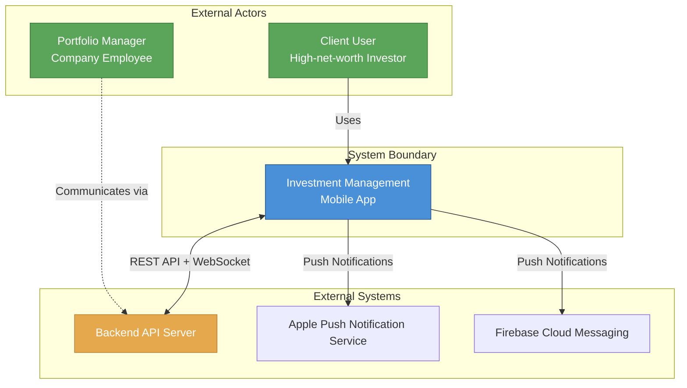
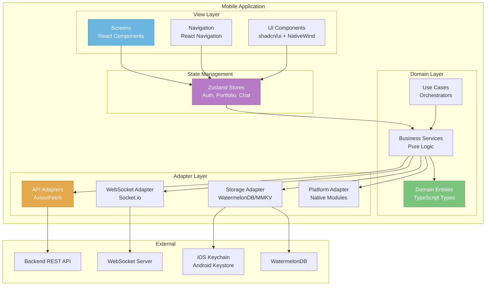
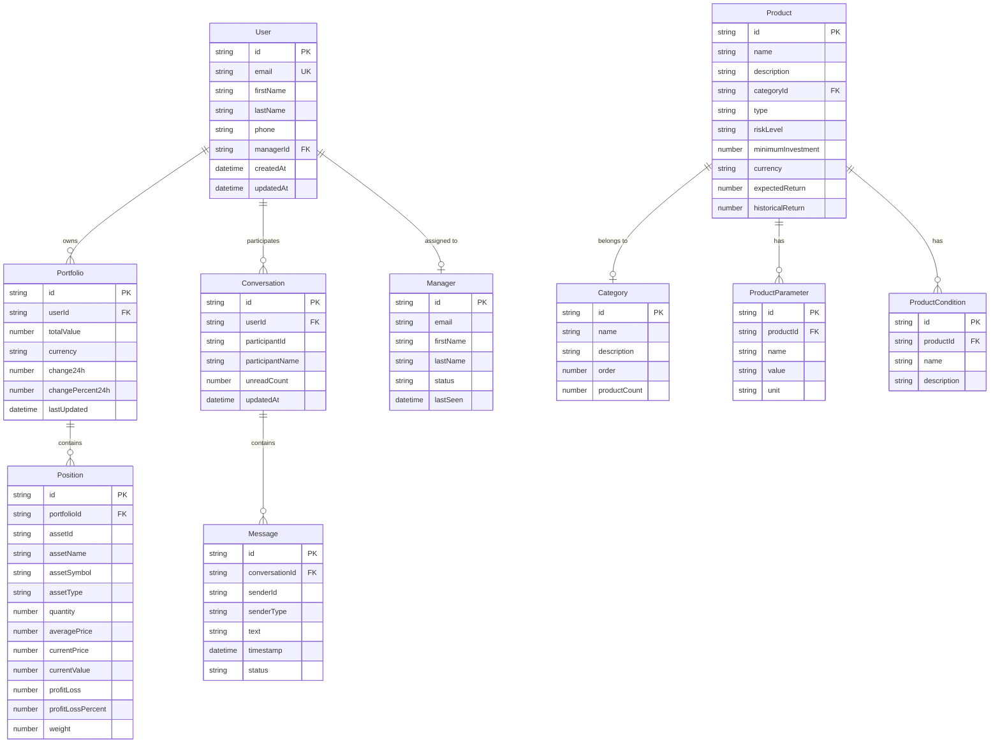
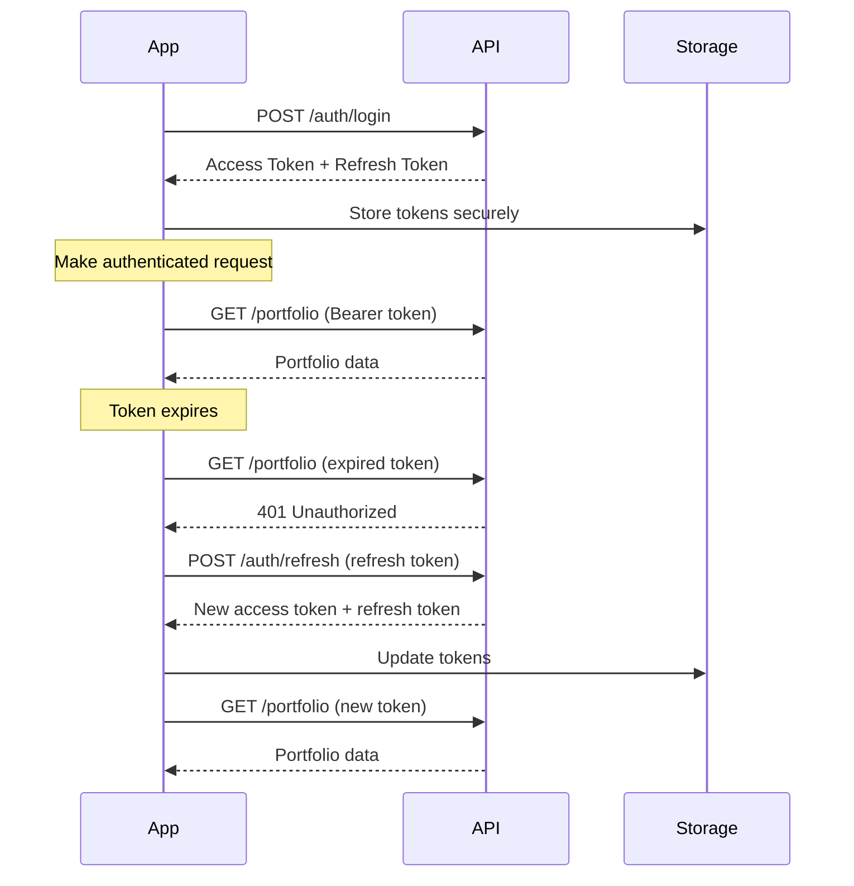
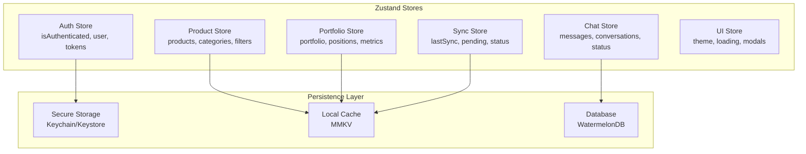
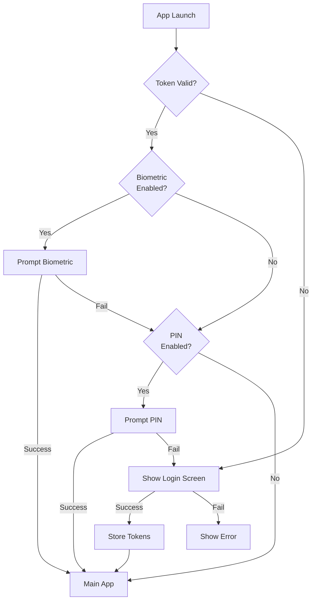
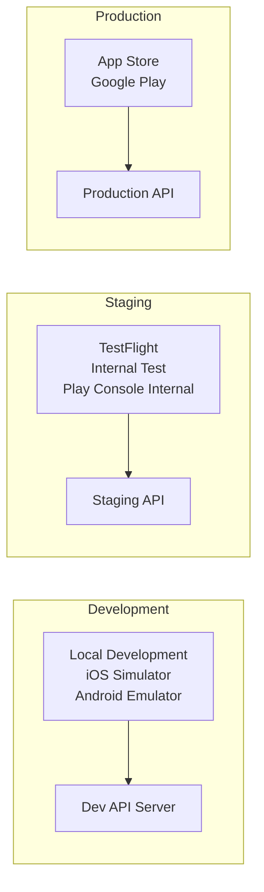
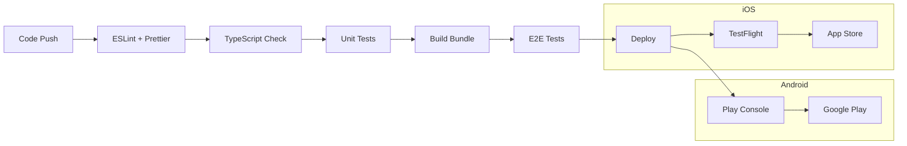

# System Design Document

## 1. Overview

### 1.1 System Purpose

The Investment Management Mobile Application is a cross-platform mobile application designed for clients of an investment management company (управляющая компания). The system enables high-net-worth investors to:

- **View investment products**: Browse strategies and individual trust management offerings
- **Monitor portfolio**: Track assets under management in real-time
- **Communicate with managers**: Chat directly with personal portfolio managers

### 1.2 System Goals

| Goal | Description | Priority |
|------|-------------|----------|
| **Security** | Protect sensitive financial and personal data | Critical |
| **Performance** | Fast, responsive user experience | High |
| **Reliability** | Consistent operation with offline support | High |
| **Usability** | Intuitive interface for non-technical users | High |
| **Maintainability** | Clean architecture for easy updates | Medium |

### 1.3 Key Stakeholders

| Stakeholder | Role | Interest |
|-------------|------|----------|
| **Client Users** | End users | View portfolio, communicate with manager, browse products |
| **Portfolio Managers** | Company employees | Communicate with clients, manage relationships |
| **Investment Company** | Service provider | Deliver mobile experience to clients |
| **Development Team** | Builders | Implement and maintain the system |
| **Operations Team** | Support | Deploy, monitor, and support the application |

### 1.4 Scope

**In Scope (MVP):**
- Authentication with biometric support and PIN
- Product showcase (strategies and products)
- Portfolio dashboard with positions
- Real-time chat with personal manager
- Push notifications
- Offline data caching

**Out of Scope:**
- Self-registration (clients are pre-onboarded)
- Trading/transaction execution
- File attachments in chat
- Multiple conversations per client

---

## 2. Architecture Diagrams (C4 Model)

### 2.1 Context Diagram (Level 1)

Shows the system in its environment with users and external systems.



**Context Description:**
- **Client Users** interact with the mobile app to view their investments, browse products, and chat with their manager
- **Portfolio Managers** communicate with clients through the backend system
- **Backend API Server** provides all business logic, data storage, and real-time communication infrastructure
- **Push Notification Services** (APNs/FCM) deliver alerts for messages and portfolio updates

### 2.2 Container Diagram (Level 2)

Shows the high-level containers within the mobile application.



**Container Descriptions:**

| Container | Technology | Description |
|-----------|------------|-------------|
| **View Layer** | React Native, TypeScript | UI components, screens, navigation |
| **Domain Layer** | TypeScript | Pure business logic, no external dependencies |
| **Adapter Layer** | Axios, Socket.io, Native modules | External system integrations |
| **State Management** | Zustand | Global application state |
| **Secure Storage** | iOS Keychain / Android Keystore | Token and credential storage |
| **Local Database** | WatermelonDB | Offline data persistence |

### 2.3 Component Diagram (Level 3)

Detailed component breakdown for each major module.

```mermaid
graph TB
    subgraph "View Layer"
        subgraph "Authentication Module"
            LoginScreen[Login Screen]
            PINScreen[PIN Screen]
            BiometricPrompt[Biometric Prompt]
        end
        
        subgraph "Product Module"
            ProductListScreen[Product List Screen]
            ProductDetailScreen[Product Detail Screen]
            StrategyCard[Strategy Card Component]
        end
        
        subgraph "Portfolio Module"
            PortfolioScreen[Portfolio Overview Screen]
            PositionDetailScreen[Position Detail Screen]
            PositionList[Position List Component]
            ValueDisplay[Value Display Component]
        end
        
        subgraph "Chat Module"
            ChatScreen[Chat Screen]
            MessageList[Message List Component]
            MessageInput[Message Input Component]
            StatusIndicator[Manager Status Indicator]
        end
    end
    
    subgraph "Domain Layer"
        AuthService[Auth Service]
        ProductService[Product Service]
        PortfolioService[Portfolio Service]
        ChatService[Chat Service]
        SyncService[Sync Service]
        CalculatorService[Portfolio Calculator]
    end
    
    subgraph "Adapter Layer"
        AuthAdapter[Auth Adapter]
        ProductAdapter[Product Adapter]
        PortfolioAdapter[Portfolio Adapter]
        ChatAdapter[Chat Adapter]
        WebSocketAdapter[WebSocket Adapter]
        TokenStorage[Token Storage]
        MessageStorage[Message Storage]
    end
    
    LoginScreen --> AuthService
    PINScreen --> AuthService
    BiometricPrompt --> AuthService
    ProductListScreen --> ProductService
    ProductDetailScreen --> ProductService
    PortfolioScreen --> PortfolioService
    PositionDetailScreen --> PortfolioService
    ChatScreen --> ChatService
    MessageList --> ChatService
    MessageInput --> ChatService
    
    AuthService --> AuthAdapter
    AuthService --> TokenStorage
    ProductService --> ProductAdapter
    PortfolioService --> PortfolioAdapter
    PortfolioService --> CalculatorService
    ChatService --> ChatAdapter
    ChatService --> WebSocketAdapter
    ChatService --> MessageStorage
    SyncService --> ProductAdapter
    SyncService --> PortfolioAdapter
    SyncService --> ChatAdapter
    
    style LoginScreen fill:#6BB5E0,stroke:#4A8BC4,color:#fff
    style AuthService fill:#7BC47F,stroke:#5BA05F,color:#fff
    style AuthAdapter fill:#E5A84D,stroke:#B8843A,color:#fff
```



---

## 3. Components

### 3.1 Frontend (React Native Mobile App)

#### 3.1.1 View Layer

**Purpose:** Render UI, handle user interactions, manage UI state.

| Component | Description | Key Features |
|-----------|-------------|--------------|
| **Screens** | Page-level components | Navigation integration, data loading |
| **Components** | Reusable UI elements | Props-driven, memoized for performance |
| **Navigation** | Screen routing | React Navigation 6.x, deep linking |
| **Hooks** | UI-specific logic | Custom hooks for data fetching, events |

**View Layer Dependencies:**
- React Navigation (routing)
- NativeWind (styling)
- shadcn/ui (component library)
- React Native Reanimated (animations)

#### 3.1.2 Domain Layer

**Purpose:** Encapsulate business logic, define entities, coordinate use cases.

| Component | Description | Responsibility |
|-----------|-------------|----------------|
| **Entities** | Domain models | Define data structures and validation |
| **Services** | Business logic | Coordinate operations, enforce rules |
| **Use Cases** | Orchestrators | Coordinate complex workflows |
| **Calculators** | Financial math | Portfolio metrics, returns calculations |

**Domain Layer Principles:**
- Zero external dependencies (pure TypeScript)
- Single responsibility per service
- Interface-based dependency injection
- Comprehensive unit testing

#### 3.1.3 Adapter Layer

**Purpose:** Interface with external systems, implement domain interfaces.

| Adapter | Purpose | Technology |
|---------|---------|------------|
| **AuthAdapter** | Authentication API calls | Axios |
| **ProductAdapter** | Product catalog API | Axios |
| **PortfolioAdapter** | Portfolio data API | Axios |
| **ChatAdapter** | Chat REST API | Axios |
| **WebSocketAdapter** | Real-time communication | Socket.io |
| **TokenStorage** | Secure token storage | Keychain/Keystore |
| **MessageStorage** | Local message persistence | WatermelonDB |
| **BiometricAdapter** | Face ID / Touch ID | react-native-biometrics |
| **NetworkAdapter** | Connectivity monitoring | NetInfo |

### 3.2 Backend (Node.js)

**Note:** Backend is out of scope for this document but assumed to exist.

| Service | Description | Technology |
|---------|-------------|------------|
| **API Gateway** | REST API endpoints | Node.js + Express/Fastify |
| **Auth Service** | Authentication, tokens | JWT, OAuth 2.0 |
| **Product Service** | Product catalog | REST API |
| **Portfolio Service** | Client portfolios | REST API |
| **Chat Service** | Messaging, WebSocket | Socket.io, REST |
| **Database** | Data persistence | PostgreSQL |

### 3.3 Database (Local)

**WatermelonDB Schema:**

| Table | Purpose | Key Fields |
|-------|---------|------------|
| **products** | Cached product data | id, name, category, data |
| **categories** | Product categories | id, name, order |
| **portfolio** | Portfolio summary | id, userId, totalValue |
| **positions** | Portfolio positions | id, assetId, quantity, value |
| **messages** | Chat messages | id, conversationId, text, timestamp |
| **conversations** | Chat conversations | id, participantId, lastMessageAt |

### 3.4 External Services

| Service | Purpose | Integration |
|---------|---------|-------------|
| **APNs** | iOS push notifications | @react-native-firebase/messaging |
| **FCM** | Android push notifications | @react-native-firebase/messaging |
| **Backend API** | Business logic, data | REST + WebSocket |
| **Analytics** | Usage tracking (optional) | Firebase Analytics |
| **Crash Reporting** | Error tracking | Sentry / Crashlytics |

---

## 4. Data Model

### 4.1 Entity Relationship Diagram



### 4.2 Domain Entity Definitions

#### User Entity
```typescript
interface User {
  id: string;
  email: string;
  firstName: string;
  lastName: string;
  phone?: string;
  managerId?: string;
  createdAt: Date;
  updatedAt: Date;
}
```

#### Portfolio Entity
```typescript
interface Portfolio {
  id: string;
  userId: string;
  totalValue: number;
  currency: string;
  change24h: number;
  changePercent24h: number;
  lastUpdated: Date;
}

interface PortfolioMetrics {
  totalValue: number;
  totalReturn: number;
  totalReturnPercent: number;
  dayChange: number;
  dayChangePercent: number;
  positions: number;
  lastUpdated: Date;
}
```

#### Position Entity
```typescript
interface Position {
  id: string;
  portfolioId: string;
  assetId: string;
  assetName: string;
  assetSymbol: string;
  assetType: 'stock' | 'bond' | 'fund' | 'cash' | 'other';
  quantity: number;
  averagePrice: number;
  currentPrice: number;
  currentValue: number;
  profitLoss: number;
  profitLossPercent: number;
  weight: number; // Percentage of total portfolio
}
```

#### Product Entity
```typescript
interface Product {
  id: string;
  name: string;
  description: string;
  categoryId: string;
  type: 'strategy' | 'individual';
  riskLevel: 'low' | 'medium' | 'high';
  minimumInvestment: number;
  currency: string;
  expectedReturn?: number;
  historicalReturn?: number;
  parameters: ProductParameter[];
  conditions: ProductCondition[];
  imageUrl?: string;
}

interface ProductParameter {
  id: string;
  productId: string;
  name: string;
  value: string;
  unit?: string;
}

interface ProductCondition {
  id: string;
  productId: string;
  name: string;
  description: string;
}
```

#### Message Entity
```typescript
interface Message {
  id: string;
  conversationId: string;
  senderId: string;
  senderType: 'client' | 'manager';
  text: string;
  timestamp: Date;
  status: 'sending' | 'sent' | 'delivered' | 'read' | 'failed';
}

interface Conversation {
  id: string;
  userId: string;
  participantId: string;
  participantName: string;
  participantAvatar?: string;
  lastMessage?: Message;
  unreadCount: number;
  updatedAt: Date;
}

type ManagerStatus = 'online' | 'offline' | 'away';

interface ManagerInfo {
  id: string;
  name: string;
  status: ManagerStatus;
  lastSeen?: Date;
  avatarUrl?: string;
}
```

#### Auth Entity
```typescript
interface AuthTokens {
  accessToken: string;
  refreshToken: string;
  expiresAt: Date;
  tokenType: 'Bearer';
}

interface Credentials {
  email: string;
  password: string;
}

interface AuthState {
  isAuthenticated: boolean;
  user: User | null;
  tokens: AuthTokens | null;
  loading: boolean;
  error: string | null;
}
```

---

## 5. API Design

### 5.1 Endpoints Overview

#### Authentication API

| Method | Endpoint | Description | Auth Required |
|--------|----------|-------------|---------------|
| `POST` | `/auth/login` | User login | No |
| `POST` | `/auth/logout` | User logout | Yes |
| `POST` | `/auth/refresh` | Refresh access token | No (refresh token) |
| `POST` | `/auth/device-token` | Register push token | Yes |

**Login Request/Response:**
```typescript
// POST /auth/login
interface LoginRequest {
  email: string;
  password: string;
  deviceId?: string;
}

interface LoginResponse {
  user: User;
  tokens: {
    accessToken: string;
    refreshToken: string;
    expiresIn: number;
  };
}
```

#### User API

| Method | Endpoint | Description | Auth Required |
|--------|----------|-------------|---------------|
| `GET` | `/user/profile` | Get user profile | Yes |
| `PUT` | `/user/profile` | Update profile | Yes |
| `GET` | `/user/manager` | Get assigned manager | Yes |

#### Products API

| Method | Endpoint | Description | Auth Required |
|--------|----------|-------------|---------------|
| `GET` | `/products` | List all products | Yes |
| `GET` | `/products/:id` | Get product details | Yes |
| `GET` | `/products/categories` | Get categories | Yes |

**Products Request/Response:**
```typescript
// GET /products
interface ProductsQuery {
  categoryId?: string;
  type?: 'strategy' | 'individual';
  riskLevel?: 'low' | 'medium' | 'high';
  page?: number;
  limit?: number;
}

interface ProductsResponse {
  products: Product[];
  categories: Category[];
  pagination: {
    page: number;
    limit: number;
    total: number;
    hasMore: boolean;
  };
}
```

#### Portfolio API

| Method | Endpoint | Description | Auth Required |
|--------|----------|-------------|---------------|
| `GET` | `/portfolio` | Get portfolio summary | Yes |
| `GET` | `/portfolio/positions` | Get positions list | Yes |
| `GET` | `/portfolio/positions/:id` | Get position details | Yes |
| `GET` | `/portfolio/metrics` | Get calculated metrics | Yes |

**Portfolio Response:**
```typescript
// GET /portfolio
interface PortfolioResponse {
  portfolio: Portfolio;
  metrics: PortfolioMetrics;
  lastUpdated: string;
}

// GET /portfolio/positions
interface PositionsResponse {
  positions: Position[];
  totalValue: number;
  lastUpdated: string;
}
```

#### Chat API

| Method | Endpoint | Description | Auth Required |
|--------|----------|-------------|---------------|
| `GET` | `/chat/conversations` | Get conversations | Yes |
| `GET` | `/chat/messages` | Get message history | Yes |
| `POST` | `/chat/messages` | Send message | Yes |
| `PUT` | `/chat/messages/read` | Mark messages as read | Yes |

**Chat Request/Response:**
```typescript
// GET /chat/messages
interface MessagesQuery {
  conversationId: string;
  cursor?: string; // ISO timestamp for pagination
  limit?: number;
  direction?: 'before' | 'after';
}

interface MessagesResponse {
  messages: Message[];
  hasMore: boolean;
  nextCursor?: string;
}

// POST /chat/messages
interface SendMessageRequest {
  conversationId: string;
  text: string;
  tempId?: string; // Client-generated for correlation
}

interface SendMessageResponse {
  message: Message;
}
```

### 5.2 WebSocket Events

**Connection:**
```
WSS://api.example.com/ws/chat?token={accessToken}
```

**Client → Server Events:**
| Event | Payload | Description |
|-------|---------|-------------|
| `message` | `{ text, conversationId, tempId }` | Send message |
| `typing_start` | `{ conversationId }` | Start typing indicator |
| `typing_stop` | `{ conversationId }` | Stop typing indicator |
| `mark_read` | `{ conversationId, messageIds }` | Mark messages as read |

**Server → Client Events:**
| Event | Payload | Description |
|-------|---------|-------------|
| `message` | `Message` | New message received |
| `message_status` | `{ messageId, status }` | Message status update |
| `typing` | `{ userId, conversationId }` | User typing indicator |
| `manager_status` | `{ managerId, status }` | Manager online status |
| `error` | `{ code, message }` | Error notification |

### 5.3 Authentication

#### JWT Token Structure
```typescript
interface AccessTokenPayload {
  sub: string;        // User ID
  email: string;
  exp: number;        // Expiration timestamp
  iat: number;        // Issued at timestamp
  type: 'access';
}

interface RefreshTokenPayload {
  sub: string;
  exp: number;
  iat: number;
  type: 'refresh';
  deviceId?: string;
}
```

#### Authentication Flow


#### Token Management
| Token | Lifetime | Storage | Usage |
|-------|----------|---------|-------|
| **Access Token** | 15-30 min | Memory + Keychain | API authentication |
| **Refresh Token** | 7-30 days | Keychain/Keystore | Token refresh |

---

## 6. State Management

### 6.1 Client State Architecture



### 6.2 Store Definitions

#### Auth Store
```typescript
interface AuthStore {
  // State
  isAuthenticated: boolean;
  user: User | null;
  tokens: AuthTokens | null;
  loading: boolean;
  error: string | null;
  
  // Actions
  login: (credentials: Credentials) => Promise<void>;
  logout: () => Promise<void>;
  refreshTokens: () => Promise<void>;
  setBiometricEnabled: (enabled: boolean) => void;
  setPinEnabled: (enabled: boolean) => void;
  clearError: () => void;
}

// Implementation
export const useAuthStore = create<AuthStore>((set, get) => ({
  isAuthenticated: false,
  user: null,
  tokens: null,
  loading: false,
  error: null,
  
  login: async (credentials) => {
    set({ loading: true, error: null });
    try {
      const response = await authService.login(credentials);
      await tokenStorage.storeTokens(response.tokens);
      set({ 
        isAuthenticated: true, 
        user: response.user,
        tokens: response.tokens,
        loading: false 
      });
    } catch (error) {
      set({ error: error.message, loading: false });
    }
  },
  
  logout: async () => {
    await tokenStorage.clearTokens();
    set({ 
      isAuthenticated: false, 
      user: null, 
      tokens: null 
    });
  },
  
  // ... other actions
}));
```

#### Product Store
```typescript
interface ProductStore {
  // State
  products: Product[];
  categories: Category[];
  selectedProduct: Product | null;
  filters: ProductFilters;
  loading: boolean;
  error: string | null;
  
  // Actions
  fetchProducts: () => Promise<void>;
  fetchProductDetail: (id: string) => Promise<void>;
  setFilters: (filters: ProductFilters) => void;
  clearFilters: () => void;
  selectProduct: (product: Product | null) => void;
}
```

#### Portfolio Store
```typescript
interface PortfolioStore {
  // State
  portfolio: Portfolio | null;
  positions: Position[];
  metrics: PortfolioMetrics | null;
  loading: boolean;
  error: string | null;
  lastUpdated: Date | null;
  
  // Actions
  fetchPortfolio: () => Promise<void>;
  fetchPositions: () => Promise<void>;
  calculateMetrics: () => void;
  refresh: () => Promise<void>;
}
```

#### Chat Store
```typescript
interface ChatStore {
  // State
  conversations: Conversation[];
  activeConversation: Conversation | null;
  messages: Record<string, Message[]>; // conversationId -> messages
  managerStatus: ManagerStatus;
  unreadCount: number;
  loading: boolean;
  sending: boolean;
  error: string | null;
  connected: boolean;
  
  // Actions
  connect: () => Promise<void>;
  disconnect: () => void;
  fetchMessages: (conversationId: string) => Promise<void>;
  sendMessage: (conversationId: string, text: string) => Promise<void>;
  addMessage: (message: Message) => void;
  markAsRead: (conversationId: string) => void;
  updateManagerStatus: (status: ManagerStatus) => void;
}
```

#### Sync Store
```typescript
interface SyncStore {
  // State
  lastSync: Date | null;
  syncStatus: 'idle' | 'syncing' | 'error' | 'offline';
  pendingOperations: PendingOperation[];
  
  // Actions
  sync: () => Promise<void>;
  addToQueue: (operation: PendingOperation) => void;
  processQueue: () => Promise<void>;
  setSyncStatus: (status: SyncStatus) => void;
  clearQueue: () => void;
}

interface PendingOperation {
  id: string;
  type: 'sendMessage' | 'markRead' | 'updateProfile';
  payload: unknown;
  timestamp: Date;
  retries: number;
}
```

### 6.3 Server State

Server state is managed through React Query / TanStack Query pattern (optional integration):

```typescript
// Query hooks for server state
const useProducts = () => useQuery({
  queryKey: ['products'],
  queryFn: () => productAdapter.getProducts(),
  staleTime: 5 * 60 * 1000, // 5 minutes
});

const usePortfolio = () => useQuery({
  queryKey: ['portfolio'],
  queryFn: () => portfolioAdapter.getPortfolio(),
  staleTime: 1 * 60 * 1000, // 1 minute
});

// Mutation for sending messages
const useSendMessage = () => useMutation({
  mutationFn: (message: NewMessage) => chatAdapter.sendMessage(message),
  onMutate: async (message) => {
    // Optimistic update
    await queryClient.cancelQueries(['messages']);
    const previous = queryClient.getQueryData(['messages']);
    queryClient.setQueryData(['messages'], (old) => [...old, message]);
    return { previous };
  },
  onError: (err, message, context) => {
    // Rollback on error
    queryClient.setQueryData(['messages'], context.previous);
  },
});
```

---

## 7. Security

### 7.1 Authentication & Authorization

#### Authentication Methods

| Method | Use Case | Security Level |
|--------|----------|----------------|
| **Email + Password** | Primary login | High (server validation) |
| **Biometric** | Quick re-entry | High (hardware-backed) |
| **PIN Code** | Quick re-entry (fallback) | Medium (local validation) |

#### Authentication Flow


#### Token Security

| Aspect | Implementation |
|--------|----------------|
| **Storage** | iOS Keychain / Android Keystore (hardware-backed) |
| **Access Token Lifetime** | 15-30 minutes |
| **Refresh Token Lifetime** | 7-30 days |
| **Refresh Token Rotation** | New refresh token on each refresh |
| **Token Binding** | Device ID in refresh token |
| **Revocation** | Server-side blacklist for compromised tokens |

### 7.2 Data Protection

#### Data Classification

| Data Type | Classification | Storage | Protection |
|-----------|---------------|---------|------------|
| **Auth Tokens** | Critical | Keychain/Keystore | Hardware encryption |
| **PIN Code** | Critical | Keychain/Keystore | bcrypt hash |
| **Portfolio Data** | Sensitive | Local DB | Encrypted at rest |
| **Messages** | Sensitive | Local DB | Encrypted at rest |
| **User Profile** | Sensitive | Local DB | Encrypted at rest |
| **Products** | Public | Local Cache | No encryption needed |

#### Protection Mechanisms

| Layer | Mechanism | Implementation |
|-------|-----------|----------------|
| **Transport** | TLS 1.2+ | HTTPS for all API calls |
| **Transport** | Certificate Pinning | Public key pinning for API |
| **Storage** | Encryption | SQLCipher / Realm encryption |
| **Storage** | Keychain/Keystore | Hardware-backed secure storage |
| **Memory** | Sensitive data clearing | Clear on app background |
| **Code** | Obfuscation | ProGuard (Android), stripping (iOS) |

#### Security Best Practices

```typescript
// Sensitive data handling
class SecureDataManager {
  private sensitiveData: Map<string, string> = new Map();
  
  // Store sensitive data
  async storeSecure(key: string, value: string): Promise<void> {
    await Keychain.setGenericPassword('app', value, {
      service: key,
      accessControl: Keychain.ACCESS_CONTROL.BIOMETRY_CURRENT_SET,
    });
  }
  
  // Retrieve sensitive data
  async retrieveSecure(key: string): Promise<string | null> {
    const result = await Keychain.getGenericPassword({ service: key });
    return result ? result.password : null;
  }
  
  // Clear sensitive data on app background
  clearSensitiveMemory(): void {
    this.sensitiveData.clear();
  }
  
  // Hash PIN before storage
  async hashPin(pin: string): Promise<string> {
    const salt = await this.getOrCreateSalt();
    return bcrypt.hash(pin, salt);
  }
}
```

### 7.3 Security Checklist

| Item | Status | Notes |
|------|--------|-------|
| TLS 1.2+ for all network calls | ✅ Required | Enforce in API client |
| Certificate pinning | ✅ Required | Implement for API endpoints |
| Secure token storage | ✅ Required | Keychain/Keystore only |
| No sensitive data in logs | ✅ Required | Strip in production |
| Input validation | ✅ Required | Zod schemas |
| Root/jailbreak detection | ⚠️ Optional | Warn user |
| Screenshot blocking | ⚠️ Optional | Sensitive screens only |
| Biometric fallback | ✅ Required | Device passcode |

---

## 8. Deployment

### 8.1 Environment Overview



### 8.2 Build Configuration

| Environment | Bundle ID | API URL | Features |
|-------------|-----------|---------|----------|
| **Development** | `com.investapp.dev` | `https://api-dev.example.com` | Debug menu, verbose logging |
| **Staging** | `com.investapp.staging` | `https://api-staging.example.com` | Analytics enabled |
| **Production** | `com.investapp` | `https://api.example.com` | Full security, no debug |

### 8.3 CI/CD Pipeline



### 8.4 Release Process

| Phase | Action | Tool |
|-------|--------|------|
| **1. Code Quality** | Lint, format, type check | ESLint, Prettier, tsc |
| **2. Testing** | Unit tests, E2E tests | Jest, Detox |
| **3. Build** | Generate bundles | React Native CLI |
| **4. iOS Deploy** | Upload to TestFlight | Fastlane, Xcode |
| **5. Android Deploy** | Upload to Play Console | Fastlane, Gradle |
| **6. Review** | App store review | Manual |
| **7. Release** | Production rollout | Phased rollout |

### 8.5 Monitoring & Observability

| Aspect | Tool | Purpose |
|--------|------|---------|
| **Crash Reporting** | Sentry / Crashlytics | Track and fix crashes |
| **Analytics** | Firebase Analytics | User behavior, funnels |
| **Performance** | Firebase Performance | App performance metrics |
| **Logging** | Sentry | Centralized logging |
| **APM** | Datadog / New Relic | Backend monitoring |

---

## 9. Technical Standards

### 9.1 Code Organization

```
src/
├── view/                    # View Layer
│   ├── screens/             # Screen components
│   │   ├── auth/            # Login, PIN, Biometric screens
│   │   ├── products/        # Product list, detail screens
│   │   ├── portfolio/       # Portfolio, position screens
│   │   ├── chat/            # Chat screens
│   │   └── profile/         # Profile, settings screens
│   ├── components/          # Reusable UI components
│   │   ├── common/          # Button, Input, Card, etc.
│   │   ├── products/        # Product-specific components
│   │   ├── portfolio/       # Portfolio-specific components
│   │   └── chat/            # Chat-specific components
│   ├── navigation/          # Navigation configuration
│   │   ├── AppNavigator.tsx
│   │   ├── AuthNavigator.tsx
│   │   └── TabNavigator.tsx
│   └── hooks/               # UI-specific hooks
│       ├── useAuth.ts
│       ├── useProducts.ts
│       └── usePortfolio.ts
├── domain/                  # Domain Layer
│   ├── entities/            # Domain models/types
│   │   ├── User.ts
│   │   ├── Product.ts
│   │   ├── Portfolio.ts
│   │   └── Message.ts
│   ├── services/            # Business logic services
│   │   ├── AuthService.ts
│   │   ├── ProductService.ts
│   │   ├── PortfolioService.ts
│   │   └── ChatService.ts
│   ├── usecases/            # Use case orchestrators
│   │   ├── LoginUseCase.ts
│   │   └── CalculateMetricsUseCase.ts
│   ├── calculators/         # Financial calculations
│   │   └── PortfolioCalculator.ts
│   └── utils/               # Domain utilities
│       ├── formatters.ts
│       └── validators.ts
├── adapters/                # Adapter Layer
│   ├── api/                 # REST API clients
│   │   ├── ApiClient.ts
│   │   ├── AuthAdapter.ts
│   │   ├── ProductAdapter.ts
│   │   └── ChatAdapter.ts
│   ├── websocket/           # WebSocket clients
│   │   └── ChatWebSocket.ts
│   ├── storage/             # Local storage adapters
│   │   ├── SecureStorage.ts
│   │   ├── CacheAdapter.ts
│   │   └── MessageStorage.ts
│   └── platform/            # Platform integrations
│       ├── BiometricAdapter.ts
│       ├── NetworkAdapter.ts
│       └── NotificationAdapter.ts
├── stores/                  # Zustand state stores
│   ├── authStore.ts
│   ├── productStore.ts
│   ├── portfolioStore.ts
│   ├── chatStore.ts
│   └── syncStore.ts
├── shared/                  # Shared utilities
│   ├── types/               # Shared TypeScript types
│   ├── constants/           # App constants
│   │   ├── ApiConstants.ts
│   │   └── AppConstants.ts
│   └── utils/               # Shared utilities
│       ├── Logger.ts
│       └── ErrorHandler.ts
├── db/                      # Database schemas
│   ├── schema.ts
│   └── migrations/
└── App.tsx                  # App entry point
```

### 9.2 Naming Conventions

| Type | Convention | Example |
|------|------------|---------|
| **Components** | PascalCase | `ProductCard.tsx` |
| **Screens** | PascalCase + Screen | `PortfolioScreen.tsx` |
| **Hooks** | camelCase + use | `useAuth.ts` |
| **Services** | PascalCase + Service | `AuthService.ts` |
| **Adapters** | PascalCase + Adapter | `ProductAdapter.ts` |
| **Stores** | camelCase + Store | `authStore.ts` |
| **Types/Interfaces** | PascalCase | `Portfolio`, `Message` |
| **Constants** | SCREAMING_SNAKE | `API_TIMEOUT_MS` |
| **Files** | PascalCase for components | `Button.tsx` |
| **Folders** | kebab-case | `product-list/` |

### 9.3 TypeScript Standards

```typescript
// tsconfig.json
{
  "compilerOptions": {
    "strict": true,
    "noImplicitAny": true,
    "strictNullChecks": true,
    "noUnusedLocals": true,
    "noUnusedParameters": true,
    "noImplicitReturns": true,
    "noFallthroughCasesInSwitch": true
  }
}
```

**Standards:**
- No `any` types (use `unknown` if necessary)
- Explicit return types for public functions
- Interface for object shapes
- Type for unions, primitives, and utility types
- Zod for runtime validation

---

## 10. Technology Stack

### 10.1 Core Dependencies

| Category | Package | Version | Purpose |
|----------|---------|---------|---------|
| **Framework** | react-native | 0.73+ | Cross-platform mobile |
| **Language** | typescript | 5.0+ | Type safety |
| **State** | zustand | 4.4+ | Global state management |
| **Navigation** | @react-navigation/native | 6.x | Screen navigation |
| **Styling** | nativewind | 4.x | Tailwind CSS for RN |
| **UI Components** | shadcn/ui | latest | Component library |
| **HTTP** | axios | 1.6+ | API requests |
| **WebSocket** | socket.io-client | 4.x | Real-time chat |
| **Secure Storage** | react-native-keychain | 8.x | Token storage |
| **Local DB** | @nozbe/watermelondb | 0.27+ | Offline storage |
| **Biometrics** | react-native-biometrics | 3.x | Face ID/Touch ID |
| **Push** | @react-native-firebase/messaging | 18.x | Push notifications |
| **Network** | @react-native-community/netinfo | 11.x | Connection monitoring |
| **Forms** | react-hook-form | 7.x | Form handling |
| **Validation** | zod | 3.x | Schema validation |
| **Animations** | react-native-reanimated | 3.x | Smooth animations |

### 10.2 Development Dependencies

| Category | Package | Purpose |
|----------|---------|---------|
| **Testing** | jest | Unit tests |
| **Testing** | @testing-library/react-native | Component tests |
| **E2E** | detox | End-to-end tests |
| **Linting** | eslint | Code quality |
| **Formatting** | prettier | Code formatting |
| **Types** | @types/* | TypeScript definitions |
| **Build** | @react-native-community/cli | Build tools |

---

## 11. Glossary

| Term | Definition |
|------|------------|
| **View Layer** | UI components, screens, and navigation |
| **Domain Layer** | Business logic, entities, and use cases |
| **Adapter Layer** | External integrations, API clients, storage |
| **Store** | Zustand state container for a specific domain |
| **Adapter** | Implementation of a domain interface for external systems |
| **Use Case** | Orchestrator for complex business workflows |
| **Entity** | Core business object with identity |
| **Service** | Domain logic coordinator |
| **Deep Link** | URL scheme to navigate directly to app content |
| **Token** | JWT authentication credential |
| **WatermelonDB** | Local-first database for React Native |
| **Zustand** | Lightweight state management library |
| **NativeWind** | Tailwind CSS for React Native |

---

## 12. Appendix

### A. Key Architectural Decisions

| Decision | Choice | Rationale |
|----------|--------|-----------|
| **Architecture Pattern** | Clean Architecture (3-Layer) | Separation of concerns, testability, maintainability |
| **State Management** | Zustand | Minimal boilerplate, excellent TypeScript support, small bundle size |
| **Local Database** | WatermelonDB | Performance, lazy loading, observability, offline-first |
| **WebSocket** | Socket.io | Reliability, automatic reconnection, fallback transports |
| **Styling** | NativeWind | Developer experience, Tailwind familiarity, consistency |
| **Navigation** | React Navigation 6.x | Industry standard, deep linking support, type-safe |
| **Secure Storage** | Keychain/Keystore | Hardware-backed security, platform standard |

### B. Performance Targets

| Metric | Target | Maximum |
|--------|--------|---------|
| App cold start | < 2s | < 3s |
| App warm start | < 1s | < 2s |
| Screen transition | < 300ms | < 500ms |
| API response (cached) | < 100ms | < 200ms |
| API response (network) | < 1s | < 3s |
| Message send (optimistic) | < 50ms | < 100ms |
| List scroll | 60 FPS | 30 FPS |

### C. Security Requirements

| Requirement | Implementation |
|-------------|----------------|
| TLS 1.2+ | Enforced on all API calls |
| Certificate Pinning | Public key pinning |
| Token Storage | Hardware-backed secure storage |
| PIN Storage | bcrypt hash |
| Data at Rest | Encrypted database |
| Data in Transit | TLS encryption |

---

*System Design Document - Version 1.0*  
*Created by System Architect Agent*  
*Date: 2026-04-17*