# System Design Document

## Document Information
| Field | Value |
|-------|-------|
| Project | Wealth Management Mobile App |
| Created | 2026-04-13 |
| Author | System Architect |
| Status | Draft |
| Version | 1.0 |

---

## Table of Contents
1. [Architecture Overview](#1-architecture-overview)
2. [C4 Model Diagrams](#2-c4-model-diagrams)
3. [Architecture Pattern](#3-architecture-pattern)
4. [System Layers](#4-system-layers)
5. [Component Design](#5-component-design)
6. [Data Flow](#6-data-flow)
7. [State Management](#7-state-management)
8. [API Design](#8-api-design)
9. [Data Models](#9-data-models)
10. [Security Architecture](#10-security-architecture)
11. [Offline Strategy](#11-offline-strategy)
12. [Third-Party Integrations](#12-third-party-integrations)

---

## 1. Architecture Overview

### 1.1 High-Level Architecture

The system follows **Clean Architecture** principles adapted for React Native mobile applications. This ensures:
- **Separation of Concerns**: Business logic isolated from UI and infrastructure
- **Testability**: Each layer can be tested independently
- **Maintainability**: Changes in one layer don't cascade to others
- **Flexibility**: Easy to swap implementations (e.g., different state management)

### 1.2 Technology Stack

| Layer | Technology | Purpose |
|-------|------------|---------|
| Presentation | React Native + TypeScript | UI components and screens |
| State Management | Zustand | Lightweight, performant state |
| Navigation | React Navigation 6.x | Screen navigation |
| Styling | NativeWind (Tailwind for RN) | Utility-first styling |
| UI Components | shadcn/ui (adapted) | Consistent design system |
| Networking | Axios + React Query | API calls and caching |
| Storage | MMKV + SQLite | Local data persistence |
| Authentication | react-native-keychain | Secure credential storage |
| Biometrics | react-native-biometrics | Touch ID / Face ID |

---

## 2. C4 Model Diagrams

### 2.1 Context Diagram (Level 1)

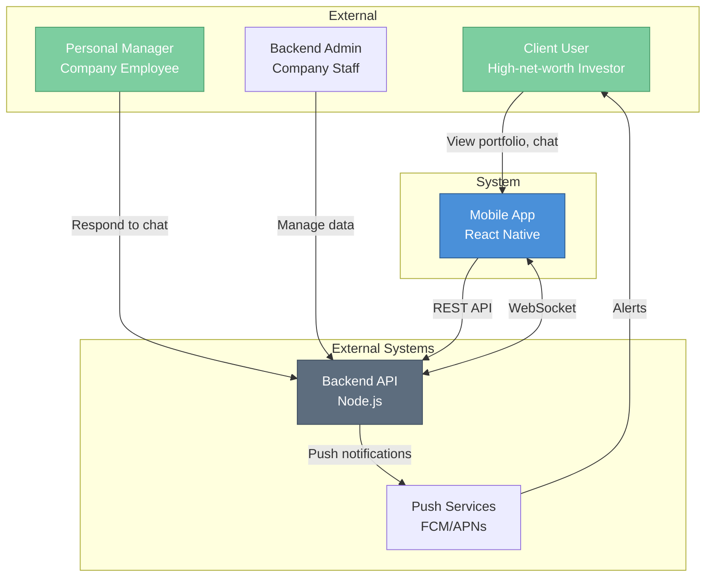

### 2.2 Container Diagram (Level 2)

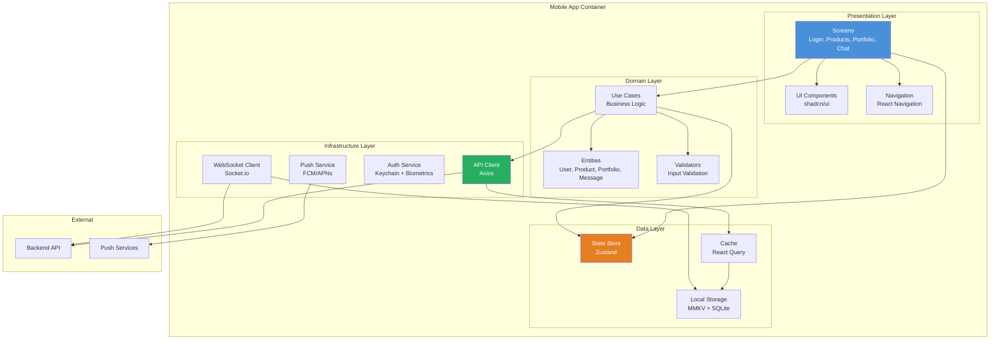

### 2.3 Component Diagram (Level 3)

```mermaid
graph TB
    subgraph "Authentication Module"
        AuthScreen[Auth Screen]
        LoginForm[Login Form]
        BiometricBtn[Biometric Button]
        AuthStore[Auth Store]
        AuthAPI[Auth API]
        TokenManager[Token Manager]
    end
    
    subgraph "Products Module"
        ProductsScreen[Products Screen]
        ProductDetail[Product Detail]
        ProductCard[Product Card]
        ProductsStore[Products Store]
        ProductsAPI[Products API]
        ProductsCache[Products Cache]
    end
    
    subgraph "Portfolio Module"
        PortfolioScreen[Portfolio Screen]
        PortfolioChart[Portfolio Chart]
        AssetList[Asset List]
        PortfolioStore[Portfolio Store]
        PortfolioAPI[Portfolio API]
        PortfolioCache[Portfolio Cache]
    end
    
    subgraph "Chat Module"
        ChatScreen[Chat Screen]
        MessageList[Message List]
        MessageInput[Message Input]
        ChatStore[Chat Store]
        ChatAPI[Chat API]
        WebSocket[WebSocket Client]
    end
    
    AuthScreen --> LoginForm
    AuthScreen --> BiometricBtn
    LoginForm --> AuthStore
    BiometricBtn --> TokenManager
    AuthStore --> AuthAPI
    AuthStore --> TokenManager
    
    ProductsScreen --> ProductCard
    ProductCard --> ProductsStore
    ProductsScreen --> ProductDetail
    ProductsStore --> ProductsAPI
    ProductsStore --> ProductsCache
    
    PortfolioScreen --> PortfolioChart
    PortfolioScreen --> AssetList
    PortfolioChart --> PortfolioStore
    AssetList --> PortfolioStore
    PortfolioStore --> PortfolioAPI
    PortfolioStore --> PortfolioCache
    
    ChatScreen --> MessageList
    ChatScreen --> MessageInput
    MessageList --> ChatStore
    MessageInput --> ChatStore
    ChatStore --> ChatAPI
    ChatStore --> WebSocket
    
    style AuthScreen fill:#3498DB,color:#fff
    style ProductsScreen fill:#9B59B6,color:#fff
    style PortfolioScreen fill:#E74C3C,color:#fff
    style ChatScreen fill:#1ABC9C,color:#fff
```

---

## 3. Architecture Pattern

### 3.1 Clean Architecture for React Native

We adopt a **simplified Clean Architecture** pattern optimized for React Native:

```
┌──────────────────────────────────────────────────────────────────┐
│                    PRESENTATION LAYER                            │
│  ┌─────────────┐  ┌──────────────┐  ┌─────────────────────┐    │
│  │   Screens   │  │  Components  │  │    Navigation       │    │
│  │             │  │              │  │                     │    │
│  │ - Login     │  │ - Buttons    │  │ - Stack Navigator   │    │
│  │ - Products  │  │ - Cards      │  │ - Tab Navigator     │    │
│  │ - Portfolio │  │ - Charts     │  │ - Deep Linking      │    │
│  │ - Chat      │  │ - Forms      │  │                     │    │
│  └─────────────┘  └──────────────┘  └─────────────────────┘    │
│                           │                                      │
│                           ▼                                      │
│  ┌──────────────────────────────────────────────────────────┐  │
│  │                    STATE MANAGEMENT                       │  │
│  │                        (Zustand)                          │  │
│  └──────────────────────────────────────────────────────────┘  │
└──────────────────────────────────────────────────────────────────┘
                           │
                           ▼
┌──────────────────────────────────────────────────────────────────┐
│                      DOMAIN LAYER                                │
│  ┌─────────────┐  ┌──────────────┐  ┌─────────────────────┐    │
│  │  Entities   │  │  Use Cases   │  │     Validators      │    │
│  │             │  │              │  │                     │    │
│  │ - User      │  │ - LoginUser  │  │ - EmailValidator    │    │
│  │ - Product   │  │ - FetchData  │  │ - PhoneValidator    │    │
│  │ - Portfolio │  │ - SendMessage│  │ - PasswordValidator │    │
│  │ - Message   │  │ - UpdateData │  │ - AmountValidator   │    │
│  └─────────────┘  └──────────────┘  └─────────────────────┘    │
│                                                                  │
│  ┌──────────────────────────────────────────────────────────┐  │
│  │                   BUSINESS RULES                          │  │
│  │  - Session management policies                            │  │
│  │  - Data validation rules                                  │  │
│  │  - Offline queue management                               │  │
│  └──────────────────────────────────────────────────────────┘  │
└──────────────────────────────────────────────────────────────────┘
                           │
                           ▼
┌──────────────────────────────────────────────────────────────────┐
│                      DATA LAYER                                  │
│  ┌─────────────┐  ┌──────────────┐  ┌─────────────────────┐    │
│  │ Repositories│  │    Cache     │  │   Local Storage     │    │
│  │             │  │              │  │                     │    │
│  │ - AuthRepo  │  │ - React Query│  │ - MMKV (key-value)  │    │
│  │ - ProdRepo  │  │ - In-memory  │  │ - SQLite (structured)│    │
│  │ - PortRepo  │  │              │  │                     │    │
│  │ - ChatRepo  │  │              │  │                     │    │
│  └─────────────┘  └──────────────┘  └─────────────────────┘    │
└──────────────────────────────────────────────────────────────────┘
                           │
                           ▼
┌──────────────────────────────────────────────────────────────────┐
│                   INFRASTRUCTURE LAYER                           │
│  ┌─────────────┐  ┌──────────────┐  ┌─────────────────────┐    │
│  │ API Clients │  │   WebSocket  │  │    Native Services  │    │
│  │             │  │    Client    │  │                     │    │
│  │ - Axios     │  │              │  │ - Keychain          │    │
│  │ - Interceptors│ - Socket.io  │  │ - Biometrics        │    │
│  │ - Retry     │  │ - Reconnect  │  │ - Push Notifications│    │
│  └─────────────┘  └──────────────┘  └─────────────────────┘    │
│                                                                  │
│  ┌──────────────────────────────────────────────────────────┐  │
│  │                    EXTERNAL SERVICES                      │  │
│  │  - Backend REST API                                       │  │
│  │  - WebSocket Server                                       │  │
│  │  - Firebase Cloud Messaging                               │  │
│  │  - Apple Push Notification Service                        │  │
│  └──────────────────────────────────────────────────────────┘  │
└──────────────────────────────────────────────────────────────────┘
```

### 3.2 Dependency Flow

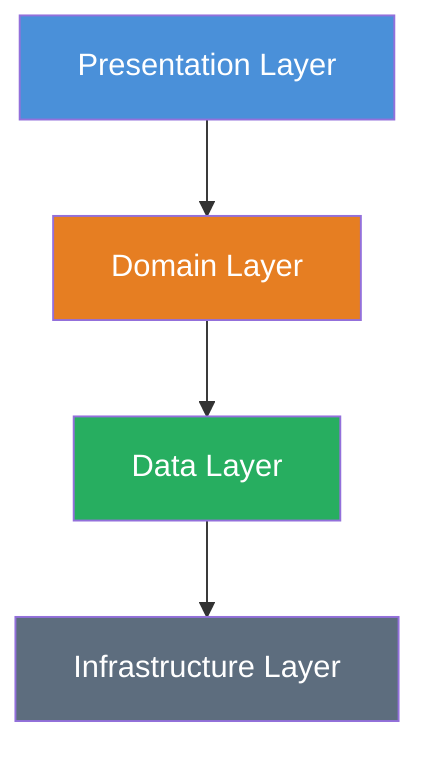

**Key Principle**: Dependencies flow inward. The Domain layer has no dependencies on outer layers.

---

## 4. System Layers

### 4.1 Presentation Layer

**Responsibilities:**
- Render UI components
- Handle user interactions
- Display data from state
- Navigation between screens

**Components:**

| Component | Description | Location |
|-----------|-------------|----------|
| Screens | Full-page components | `src/screens/` |
| UI Components | Reusable components | `src/components/ui/` |
| Feature Components | Domain-specific components | `src/components/features/` |
| Layout Components | Navigation, headers | `src/components/layout/` |
| Navigation | Screen navigation config | `src/navigation/` |

### 4.2 Domain Layer

**Responsibilities:**
- Define business entities
- Implement business logic
- Validate data
- Coordinate use cases

**Components:**

| Component | Description | Location |
|-----------|-------------|----------|
| Entities | Business objects | `src/domain/entities/` |
| Use Cases | Business operations | `src/domain/usecases/` |
| Validators | Input validation | `src/domain/validators/` |
| Types | TypeScript interfaces | `src/domain/types/` |

### 4.3 Data Layer

**Responsibilities:**
- Manage application state
- Cache API responses
- Persist local data
- Coordinate data sources

**Components:**

| Component | Description | Location |
|-----------|-------------|----------|
| Stores | Zustand state stores | `src/data/stores/` |
| Repositories | Data access abstraction | `src/data/repositories/` |
| Cache | React Query cache | `src/data/cache/` |
| Storage | Local persistence | `src/data/storage/` |

### 4.4 Infrastructure Layer

**Responsibilities:**
- Communicate with external services
- Handle authentication
- Manage push notifications
- Implement platform-specific features

**Components:**

| Component | Description | Location |
|-----------|-------------|----------|
| API Client | REST API communication | `src/infrastructure/api/` |
| WebSocket | Real-time communication | `src/infrastructure/websocket/` |
| Auth | Authentication services | `src/infrastructure/auth/` |
| Push | Push notification handling | `src/infrastructure/push/` |

---

## 5. Component Design

### 5.1 Authentication Module

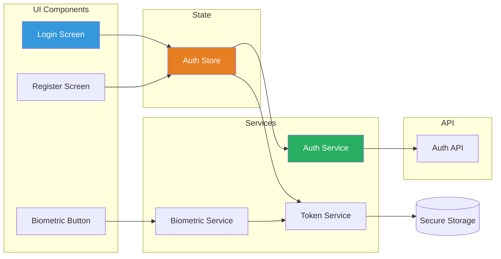

**Authentication Flow:**

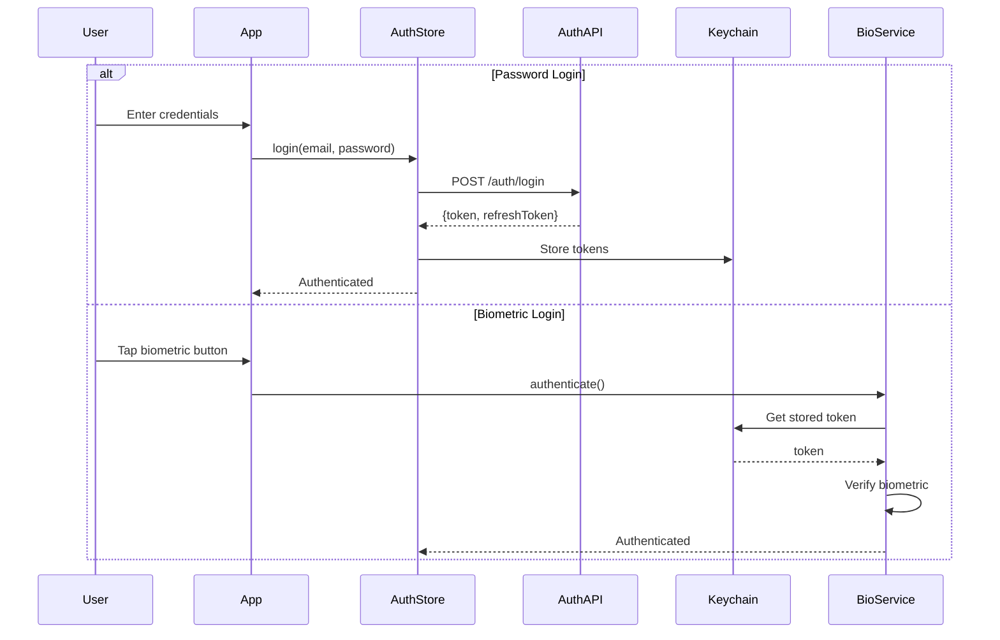

### 5.2 Products Module

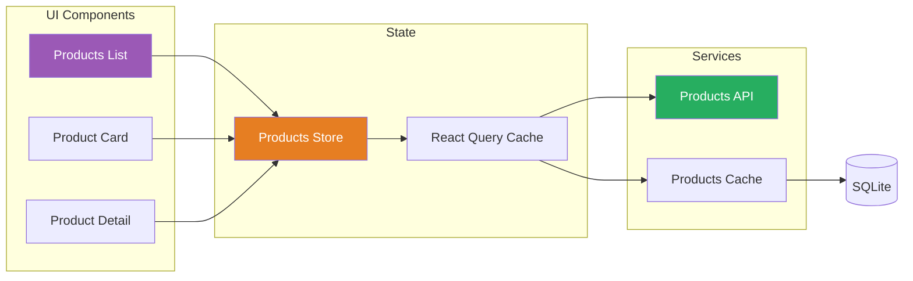

### 5.3 Portfolio Module

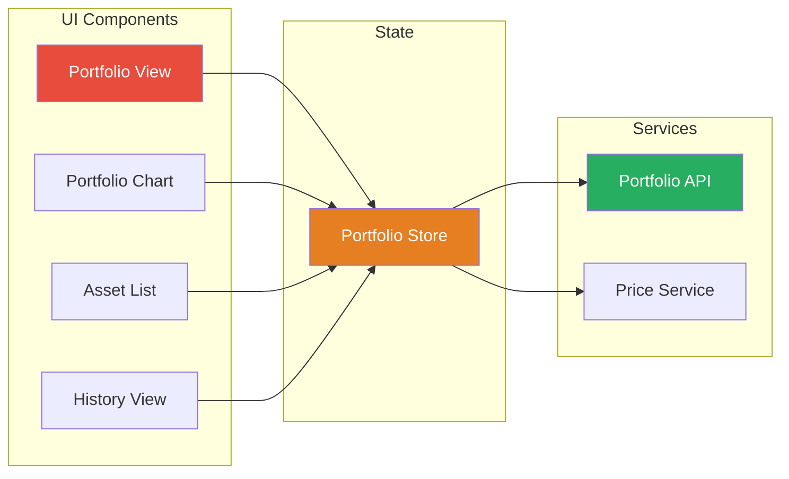

### 5.4 Chat Module

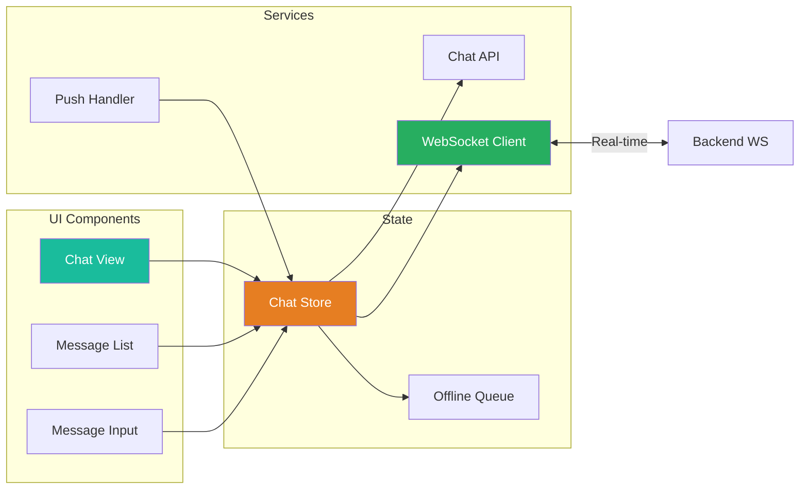

**Chat Flow:**

```mermaid
sequenceDiagram
    participant User
    participant ChatStore
    participant MessageQueue
    participant WebSocket
    participant Backend
    
    User->>ChatStore: Send message
    ChatStore->>ChatStore: Optimistic update UI
    
    alt Online
        ChatStore->>WebSocket: Emit message
        WebSocket->>Backend: Message
        Backend-->>WebSocket: Ack
        WebSocket-->>ChatStore: Delivered
    else Offline
        ChatStore->>MessageQueue: Queue message
        Note over MessageQueue: Stored locally
    end
    
    When online:
        MessageQueue->>WebSocket: Send queued
        WebSocket->>Backend: Message
    end
```

---

## 6. Data Flow

### 6.1 Unidirectional Data Flow

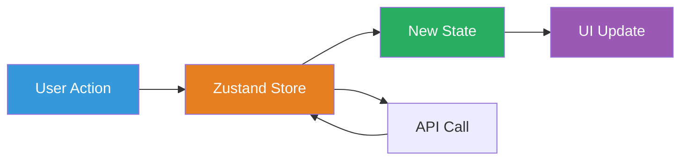

### 6.2 Data Flow Example: Loading Products

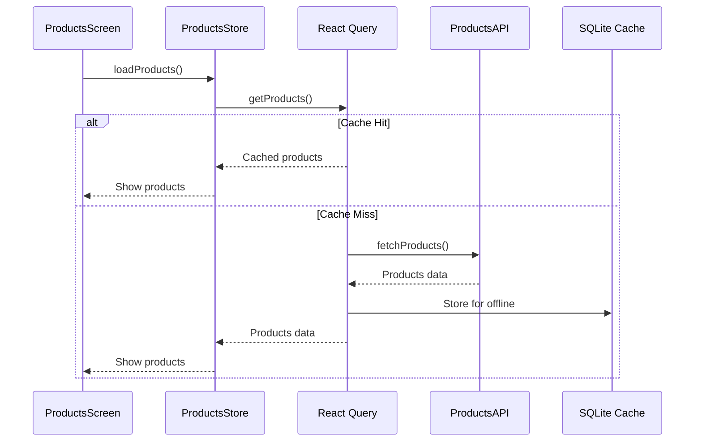

### 6.3 Data Flow Example: Sending Chat Message

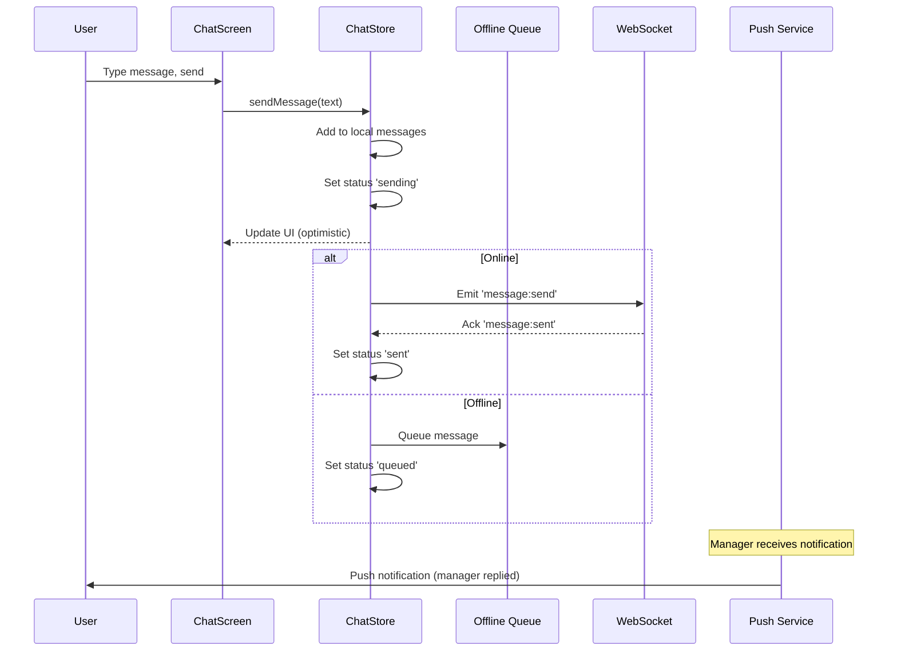

---

## 7. State Management

### 7.1 Why Zustand?

| Criteria | Zustand | Redux Toolkit | MobX |
|----------|---------|---------------|------|
| Bundle Size | ~1KB | ~11KB | ~16KB |
| Boilerplate | Minimal | Moderate | Minimal |
| Learning Curve | Low | Medium | Medium |
| TypeScript | Excellent | Good | Good |
| Performance | High | High | High |
| DevTools | Yes | Yes | Yes |
| React Native | Native | Native | Native |

**Decision: Zustand** for its simplicity, small bundle size, and excellent TypeScript support.

### 7.2 Store Architecture

```
src/data/stores/
├── index.ts              # Store exports
├── authStore.ts          # Authentication state
├── productsStore.ts      # Products state
├── portfolioStore.ts     # Portfolio state
├── chatStore.ts          # Chat state
├── userStore.ts          # User profile state
└── appStore.ts           # Global app state
```

### 7.3 Store Structure

```typescript
// Example: AuthStore
interface AuthState {
  // State
  isAuthenticated: boolean;
  user: User | null;
  token: string | null;
  isLoading: boolean;
  error: string | null;
  
  // Actions
  login: (email: string, password: string) => Promise<void>;
  logout: () => Promise<void>;
  refreshToken: () => Promise<void>;
  biometricLogin: () => Promise<void>;
  setUser: (user: User) => void;
  clearError: () => void;
}
```

### 7.4 React Query Integration

For server state (API data), we use **React Query** alongside Zustand:

| State Type | Tool | Use Case |
|------------|------|----------|
| Client State | Zustand | Auth, UI state, app settings |
| Server State | React Query | Products, Portfolio, Messages |
| Hybrid | Both | Chat (optimistic updates + sync) |

```typescript
// Example: Products with React Query
const useProducts = () => {
  return useQuery({
    queryKey: ['products'],
    queryFn: () => productsAPI.getAll(),
    staleTime: 5 * 60 * 1000, // 5 minutes
    cacheTime: 30 * 60 * 1000, // 30 minutes
  });
};
```

### 7.5 State Flow Diagram

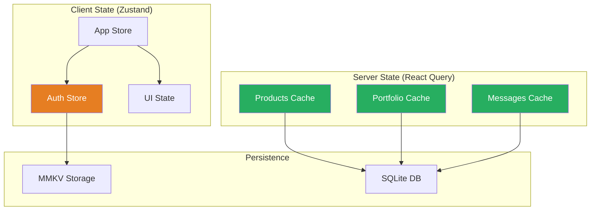

---

## 8. API Design

### 8.1 REST API Endpoints

| Endpoint | Method | Description | Auth |
|----------|--------|-------------|------|
| `/auth/login` | POST | User login | No |
| `/auth/register` | POST | User registration | No |
| `/auth/refresh` | POST | Refresh token | Yes |
| `/auth/logout` | POST | Logout | Yes |
| `/auth/forgot-password` | POST | Request password reset | No |
| `/users/me` | GET | Get current user | Yes |
| `/users/me` | PATCH | Update user profile | Yes |
| `/products` | GET | List all products | Yes |
| `/products/:id` | GET | Get product details | Yes |
| `/portfolio` | GET | Get user portfolio | Yes |
| `/portfolio/history` | GET | Get portfolio history | Yes |
| `/chat/messages` | GET | Get message history | Yes |
| `/chat/messages` | POST | Send message (REST fallback) | Yes |

### 8.2 WebSocket Events

| Event | Direction | Description |
|-------|-----------|-------------|
| `connection` | Client → Server | Establish connection |
| `authenticate` | Client → Server | Authenticate socket |
| `message:send` | Client → Server | Send new message |
| `message:received` | Server → Client | New message received |
| `message:read` | Client → Server | Mark message as read |
| `typing:start` | Client → Server | User started typing |
| `typing:stop` | Client → Server | User stopped typing |
| `portfolio:update` | Server → Client | Portfolio value changed |

### 8.3 API Client Architecture

```typescript
// API Client with interceptors
class APIClient {
  private axios: AxiosInstance;
  
  constructor() {
    this.axios = axios.create({
      baseURL: API_BASE_URL,
      timeout: 10000,
    });
    
    // Request interceptor - add auth token
    this.axios.interceptors.request.use(
      async (config) => {
        const token = await tokenManager.getAccessToken();
        if (token) {
          config.headers.Authorization = `Bearer ${token}`;
        }
        return config;
      }
    );
    
    // Response interceptor - handle token refresh
    this.axios.interceptors.response.use(
      (response) => response,
      async (error) => {
        if (error.response?.status === 401) {
          // Try to refresh token
          await this.refreshToken();
          // Retry original request
          return this.axios.request(error.config);
        }
        throw error;
      }
    );
  }
}
```

---

## 9. Data Models

### 9.1 Entity Definitions

```typescript
// User Entity
interface User {
  id: string;
  email: string;
  phone?: string;
  firstName: string;
  lastName: string;
  createdAt: string;
  updatedAt: string;
  settings: UserSettings;
}

interface UserSettings {
  notificationsEnabled: boolean;
  biometricEnabled: boolean;
  language: 'ru';
}

// Product Entity
interface Product {
  id: string;
  name: string;
  type: 'strategy' | 'individual';
  description: string;
  riskLevel: 'low' | 'medium' | 'high';
  minInvestment: number;
  expectedReturn?: number;
  currency: 'RUB' | 'USD' | 'EUR';
  status: 'active' | 'closed' | 'upcoming';
  documents: Document[];
  createdAt: string;
  updatedAt: string;
}

// Portfolio Entity
interface Portfolio {
  id: string;
  userId: string;
  totalValue: number;
  currency: string;
  lastUpdated: string;
  assets: PortfolioAsset[];
}

interface PortfolioAsset {
  id: string;
  name: string;
  type: string;
  quantity: number;
  currentValue: number;
  purchaseValue: number;
  percentage: number;
  purchaseDate: string;
}

// Message Entity
interface Message {
  id: string;
  conversationId: string;
  senderId: string;
  senderType: 'user' | 'manager';
  content: string;
  timestamp: string;
  status: 'sending' | 'sent' | 'delivered' | 'read';
  attachments?: Attachment[];
}

// Auth Tokens
interface AuthTokens {
  accessToken: string;
  refreshToken: string;
  expiresAt: number;
}
```

### 9.2 Database Schema (SQLite)

```sql
-- Cached Products
CREATE TABLE products (
  id TEXT PRIMARY KEY,
  name TEXT NOT NULL,
  type TEXT NOT NULL,
  description TEXT,
  risk_level TEXT NOT NULL,
  min_investment REAL NOT NULL,
  expected_return REAL,
  currency TEXT NOT NULL,
  status TEXT NOT NULL,
  data JSON NOT NULL,
  cached_at INTEGER NOT NULL
);

-- Cached Portfolio
CREATE TABLE portfolio (
  id TEXT PRIMARY KEY,
  user_id TEXT NOT NULL,
  total_value REAL NOT NULL,
  currency TEXT NOT NULL,
  data JSON NOT NULL,
  cached_at INTEGER NOT NULL
);

-- Messages
CREATE TABLE messages (
  id TEXT PRIMARY KEY,
  conversation_id TEXT NOT NULL,
  sender_id TEXT NOT NULL,
  sender_type TEXT NOT NULL,
  content TEXT NOT NULL,
  timestamp INTEGER NOT NULL,
  status TEXT NOT NULL,
  data JSON NOT NULL
);

-- Offline Queue
CREATE TABLE offline_queue (
  id TEXT PRIMARY KEY,
  type TEXT NOT NULL,
  data JSON NOT NULL,
  created_at INTEGER NOT NULL,
  attempts INTEGER DEFAULT 0
);

-- Create indexes
CREATE INDEX idx_messages_conversation ON messages(conversation_id);
CREATE INDEX idx_messages_timestamp ON messages(timestamp);
CREATE INDEX idx_offline_queue_created ON offline_queue(created_at);
```

---

## 10. Security Architecture

### 10.1 Security Layers

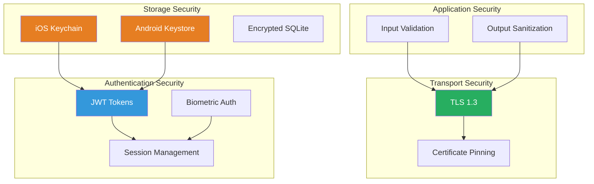

### 10.2 Token Management

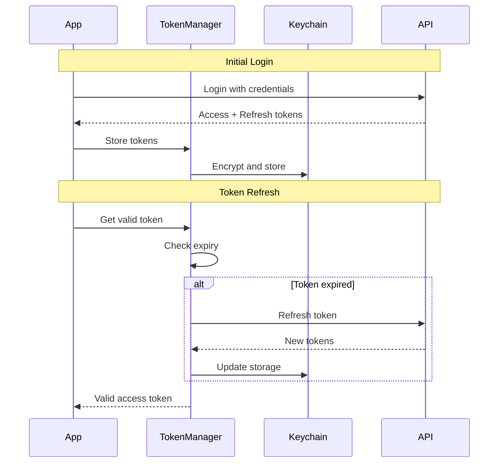

### 10.3 Security Checklist

| Area | Implementation | Status |
|------|----------------|--------|
| Transport | TLS 1.3 | Required |
| Certificate Pinning | SSL pinning in production | Recommended |
| Token Storage | Keychain/Keystore | Required |
| Sensitive Data | Encrypted SQLite | Required |
| Code Obfuscation | ProGuard/R8 | Required |
| Root Detection | Check for root/jailbreak | Recommended |
| Debug Protection | Disable debug in production | Required |
| API Key Protection | No keys in code | Required |
| Input Validation | Client + server side | Required |

---

## 11. Offline Strategy

### 11.1 Offline Architecture

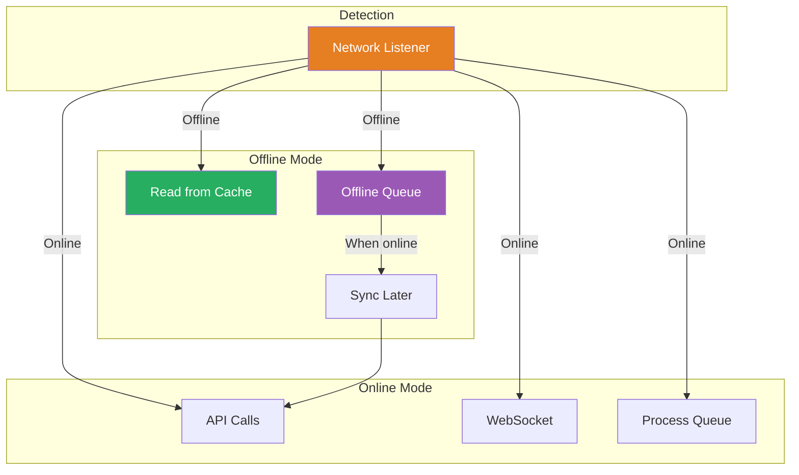

### 11.2 Feature Offline Support Matrix

| Feature | Offline Read | Offline Write | Sync Strategy |
|---------|-------------|---------------|---------------|
| Products | ✅ Full | ❌ N/A | Background refresh |
| Portfolio | ✅ Full | ❌ N/A | Background refresh |
| Chat History | ✅ Full | ✅ Queue | Sync when online |
| Authentication | ⚠️ Limited | ❌ No | Token cache only |
| User Profile | ✅ Full | ✅ Queue | Sync when online |

### 11.3 Cache Invalidation Strategy

```
┌─────────────────────────────────────────────────────────┐
│                   CACHE HIERARCHY                        │
├─────────────────────────────────────────────────────────┤
│  Level 1: Memory (React Query)                          │
│  - Stale Time: 5 minutes                                │
│  - Fast access for repeated queries                     │
├─────────────────────────────────────────────────────────┤
│  Level 2: Disk (SQLite/MMKV)                            │
│  - TTL: 24 hours                                        │
│  - Survives app restart                                 │
│  - Available offline                                    │
├─────────────────────────────────────────────────────────┤
│  Invalidation Triggers:                                 │
│  - Manual refresh (pull-to-refresh)                     │
│  - Push notification received                           │
│  - App foregrounded                                     │
│  - TTL expired                                          │
└─────────────────────────────────────────────────────────┘
```

---

## 12. Third-Party Integrations

### 12.1 Push Notifications

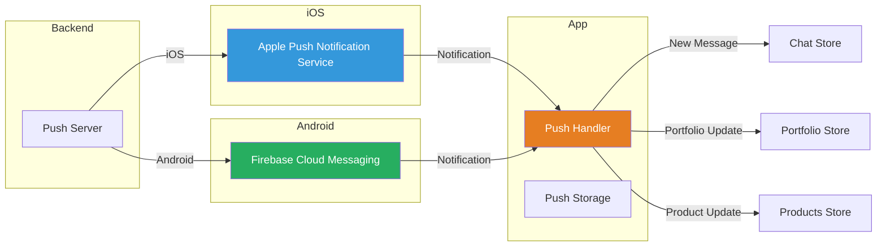

### 12.2 Analytics Integration

```typescript
// Analytics Events
enum AnalyticsEvent {
  // Authentication
  LOGIN_SUCCESS = 'login_success',
  LOGIN_FAILED = 'login_failed',
  LOGOUT = 'logout',
  BIOMETRIC_ENABLED = 'biometric_enabled',
  
  // Products
  PRODUCTS_VIEWED = 'products_viewed',
  PRODUCT_VIEWED = 'product_viewed',
  
  // Portfolio
  PORTFOLIO_VIEWED = 'portfolio_viewed',
  PORTFOLIO_HISTORY_VIEWED = 'portfolio_history_viewed',
  
  // Chat
  CHAT_OPENED = 'chat_opened',
  MESSAGE_SENT = 'message_sent',
  
  // Errors
  API_ERROR = 'api_error',
  NETWORK_ERROR = 'network_error',
}
```

### 12.3 Error Tracking

```typescript
// Error tracking setup
const setupErrorTracking = () => {
  // Global error handler
  ErrorUtils.setGlobalHandler((error, isFatal) => {
    captureException(error, {
      level: isFatal ? 'fatal' : 'error',
      tags: { source: 'global_handler' },
    });
  });
  
  // Promise rejection handler
  const defaultHandler = Promise.reject;
  Promise.reject = (reason) => {
    captureException(reason, {
      tags: { source: 'unhandled_promise' },
    });
    return defaultHandler(reason);
  };
};
```

---

## 13. Folder Structure

```
src/
├── components/
│   ├── ui/                    # Base UI components
│   │   ├── Button/
│   │   ├── Input/
│   │   ├── Card/
│   │   └── ...
│   ├── features/              # Feature-specific components
│   │   ├── auth/
│   │   ├── products/
│   │   ├── portfolio/
│   │   └── chat/
│   └── layout/                # Layout components
│       ├── Header/
│       ├── TabBar/
│       └── ...
│
├── screens/                   # Screen components
│   ├── auth/
│   │   ├── LoginScreen.tsx
│   │   └── RegisterScreen.tsx
│   ├── products/
│   │   ├── ProductsScreen.tsx
│   │   └── ProductDetailScreen.tsx
│   ├── portfolio/
│   │   └── PortfolioScreen.tsx
│   ├── chat/
│   │   └── ChatScreen.tsx
│   └── profile/
│       └── ProfileScreen.tsx
│
├── navigation/                # Navigation configuration
│   ├── RootNavigator.tsx
│   ├── AuthNavigator.tsx
│   ├── MainNavigator.tsx
│   └── linking.ts
│
├── domain/                    # Domain layer
│   ├── entities/              # Business entities
│   │   ├── User.ts
│   │   ├── Product.ts
│   │   ├── Portfolio.ts
│   │   └── Message.ts
│   ├── usecases/              # Business logic
│   │   ├── auth/
│   │   ├── products/
│   │   ├── portfolio/
│   │   └── chat/
│   ├── validators/            # Input validation
│   │   ├── email.ts
│   │   ├── password.ts
│   │   └── phone.ts
│   └── types/                 # TypeScript types
│
├── data/                      # Data layer
│   ├── stores/                # Zustand stores
│   │   ├── authStore.ts
│   │   ├── productsStore.ts
│   │   ├── portfolioStore.ts
│   │   ├── chatStore.ts
│   │   └── appStore.ts
│   ├── repositories/          # Data repositories
│   │   ├── AuthRepository.ts
│   │   ├── ProductsRepository.ts
│   │   ├── PortfolioRepository.ts
│   │   └── ChatRepository.ts
│   ├── cache/                 # React Query cache
│   │   └── queryClient.ts
│   └── storage/               # Local storage
│       ├── mmkv.ts
│       ├── database.ts
│       └── migrations/
│
├── infrastructure/            # Infrastructure layer
│   ├── api/                   # API clients
│   │   ├── client.ts
│   │   ├── auth.api.ts
│   │   ├── products.api.ts
│   │   ├── portfolio.api.ts
│   │   └── chat.api.ts
│   ├── websocket/             # WebSocket client
│   │   ├── client.ts
│   │   └── handlers.ts
│   ├── auth/                  # Auth services
│   │   ├── tokenManager.ts
│   │   └── biometrics.ts
│   └── push/                  # Push notifications
│       ├── index.ts
│       └── handlers.ts
│
├── hooks/                     # Custom hooks
│   ├── useAuth.ts
│   ├── useProducts.ts
│   ├── usePortfolio.ts
│   └── useChat.ts
│
├── utils/                     # Utility functions
│   ├── formatting.ts
│   ├── validation.ts
│   ├── network.ts
│   └── constants.ts
│
├── config/                    # Configuration
│   ├── app.ts
│   └── environment.ts
│
├── i18n/                      # Internationalization
│   └── ru/
│       └── translations.ts
│
└── App.tsx                    # App entry point
```

---

## 14. Performance Considerations

### 14.1 Optimization Strategies

| Area | Strategy | Implementation |
|------|----------|----------------|
| List Rendering | Virtualization | FlatList/FlashList |
| Images | Lazy loading + caching | react-native-fast-image |
| Animations | Native driver | react-native-reanimated |
| Bundle Size | Code splitting | Dynamic imports |
| Startup Time | Lazy loading | Splash screen + deferred init |
| Memory | Proper cleanup | useEffect cleanup functions |

### 14.2 Performance Metrics Targets

| Metric | Target | Measurement |
|--------|--------|-------------|
| App startup time | < 2s | Time to interactive |
| Screen transition | < 300ms | Frame rate monitoring |
| List scroll FPS | 60 FPS | Performance monitor |
| Memory usage | < 150MB | Memory profiling |
| Battery impact | Minimal | Background activity |

---

## 15. Testing Strategy

### 15.1 Test Pyramid

```
                    ┌─────────┐
                   │   E2E   │  (Detox)
                  │  Tests  │  - Critical user flows
                 └─────────┘
               ┌───────────────┐
              │  Integration  │  (Jest + Testing Library)
             │    Tests      │  - Component interactions
            └───────────────┘
          ┌─────────────────────┐
         │     Unit Tests       │  (Jest)
        │                       │  - Business logic
       │   (Domain + Hooks)    │  - Utilities
      └─────────────────────────┘
```

### 15.2 Test Coverage Targets

| Layer | Coverage | Focus Areas |
|-------|----------|-------------|
| Domain | 90%+ | Use cases, validators |
| Data | 80%+ | Stores, repositories |
| Infrastructure | 70%+ | API clients, services |
| Components | 60%+ | Critical user flows |

---

## 16. Deployment Architecture

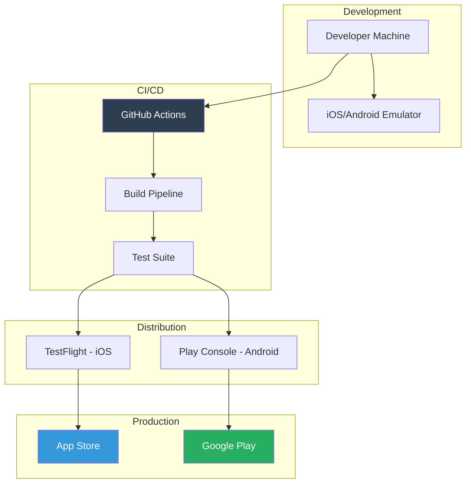

---

## 17. Summary

This system design provides a robust, scalable, and maintainable architecture for the wealth management mobile application. Key architectural decisions include:

1. **Clean Architecture** - Clear separation of concerns with four distinct layers
2. **Zustand + React Query** - Efficient state management for client and server state
3. **Offline-First** - Comprehensive caching and offline queue system
4. **Security-First** - Multiple layers of security from transport to storage
5. **Modular Design** - Feature-based module organization for scalability

The architecture supports the MVP requirements while providing a solid foundation for future enhancements.

---

## 18. Related Documents

- [Technical Requirements Analysis](./technical-requirements-analysis.md)
- ADR-001: Choose State Management (Zustand vs Redux)
- ADR-002: Choose Real-Time Protocol (WebSocket vs Polling)
- ADR-003: Choose Local Storage (MMKV + SQLite vs Realm)
- [Coding Standards](./standards.md)

---

*Document created by System Architect*
*Date: 2026-04-13*