# System Design Document

## 1. Overview

**Project:** Mobile Application for Investment Management Company Clients  
**Platform:** React Native (iOS + Android)  
**Architecture Pattern:** Clean Architecture (3-Layer)  
**Version:** 1.0  
**Date:** 2026-04-17  

---

## 2. Architecture Pattern Selection

### 2.1 Chosen Pattern: Clean Architecture

We adopt **Clean Architecture** with three distinct layers, as specified in the PRD requirements. This pattern was chosen for the following reasons:

| Criteria | Clean Architecture | Assessment |
|----------|-------------------|------------|
| **Separation of Concerns** | Strict layer boundaries | ✅ Excellent |
| **Testability** | Domain layer has no dependencies | ✅ Excellent |
| **Maintainability** | Changes isolated to specific layers | ✅ Excellent |
| **Scalability** | Modular, can grow with features | ✅ Good |
| **Learning Curve** | Requires discipline | ⚠️ Moderate |

### 2.2 Layer Definition

```
┌─────────────────────────────────────────────────────────────────┐
│                        VIEW LAYER                                │
│  ┌─────────────┐  ┌─────────────┐  ┌─────────────┐              │
│  │  Screens    │  │ Components  │  │ Navigation  │              │
│  └─────────────┘  └─────────────┘  └─────────────┘              │
│  ┌─────────────┐  ┌─────────────┐                                 │
│  │   Hooks    │  │State Stores │                                 │
│  └─────────────┘  └─────────────┘                                 │
├─────────────────────────────────────────────────────────────────┤
│                       DOMAIN LAYER                               │
│  ┌─────────────┐  ┌─────────────┐  ┌─────────────┐              │
│  │  Entities   │  │  Services   │  │  Use Cases  │              │
│  └─────────────┘  └─────────────┘  └─────────────┘              │
│  ┌─────────────┐                                                  │
│  │   Utils     │                                                  │
│  └─────────────┘                                                  │
├─────────────────────────────────────────────────────────────────┤
│                       ADAPTER LAYER                              │
│  ┌─────────────┐  ┌─────────────┐  ┌─────────────┐              │
│  │  API Adapters│ │ WebSocket   │  │   Storage   │              │
│  └─────────────┘  └─────────────┘  └─────────────┘              │
│  ┌─────────────┐  ┌─────────────┐                                 │
│  │  External   │  │  Platform   │                                 │
│  └─────────────┘  └─────────────┘                                 │
└─────────────────────────────────────────────────────────────────┘
```

**Dependencies flow inward:** View → Domain ← Adapters  
**Domain layer has ZERO external dependencies** (pure TypeScript/JavaScript)

---

## 3. C4 Model Diagrams

### 3.1 Context Diagram (Level 1)

Shows the system in its environment with users and external systems.

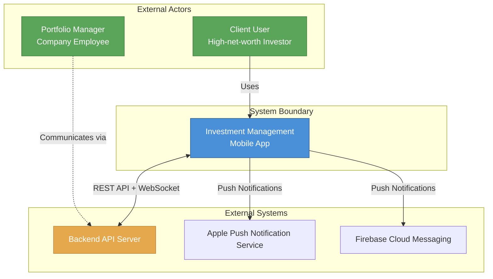

### 3.2 Container Diagram (Level 2)

Shows the high-level containers within the system.

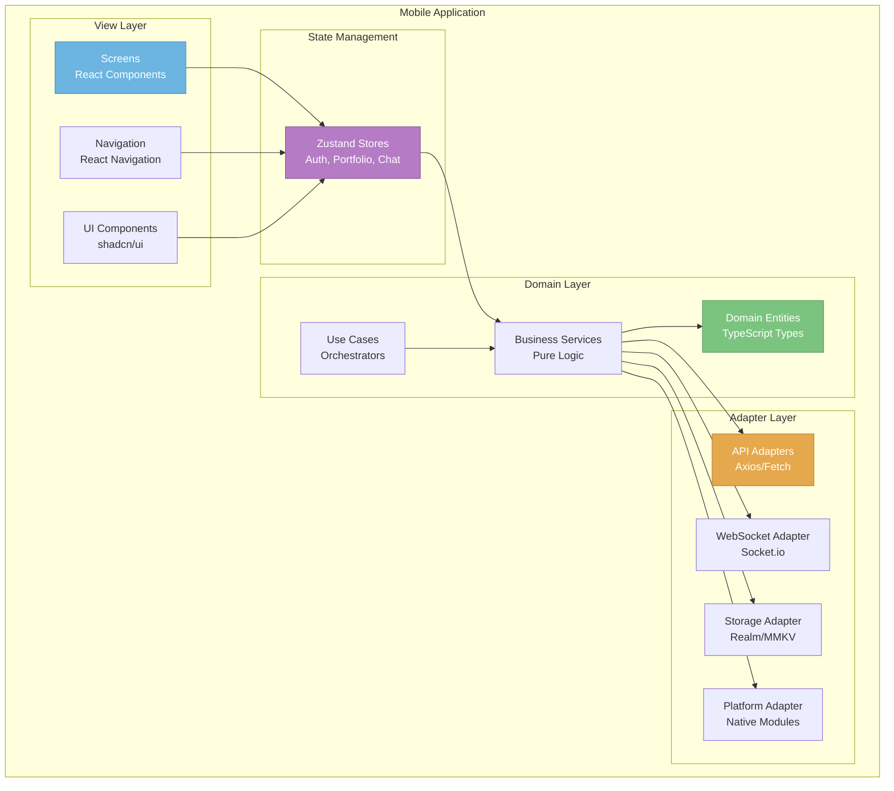

### 3.3 Component Diagram (Level 3)

Detailed component breakdown for each major module.

```mermaid
graph TB
    subgraph "View Layer Components"
        subgraph "Authentication Module"
            LoginScreen[Login Screen]
            PINScreen[PIN Screen]
            BiometricPrompt[Biometric Prompt]
        end
        
        subgraph "Product Module"
            ProductListScreen[Product List Screen]
            ProductDetailScreen[Product Detail Screen]
            StrategyCard[Strategy Card Component]
        end
        
        subgraph "Portfolio Module"
            PortfolioScreen[Portfolio Overview Screen]
            PositionDetailScreen[Position Detail Screen]
            PositionList[Position List Component]
            ValueDisplay[Value Display Component]
        end
        
        subgraph "Chat Module"
            ChatScreen[Chat Screen]
            MessageList[Message List Component]
            MessageInput[Message Input Component]
            StatusIndicator[Manager Status Indicator]
        end
    end
    
    subgraph "Domain Layer Services"
        AuthService[Auth Service]
        ProductService[Product Service]
        PortfolioService[Portfolio Service]
        ChatService[Chat Service]
        SyncService[Sync Service]
        CalculatorService[Portfolio Calculator]
    end
    
    subgraph "Adapter Layer"
        AuthAdapter[Auth Adapter]
        ProductAdapter[Product Adapter]
        PortfolioAdapter[Portfolio Adapter]
        ChatAdapter[Chat Adapter]
        WebSocketAdapter[WebSocket Adapter]
        TokenStorage[Token Storage]
        MessageStorage[Message Storage]
    end
    
    LoginScreen --> AuthService
    ProductListScreen --> ProductService
    ProductDetailScreen --> ProductService
    PortfolioScreen --> PortfolioService
    PositionDetailScreen --> PortfolioService
    ChatScreen --> ChatService
    
    AuthService --> AuthAdapter
    AuthService --> TokenStorage
    ProductService --> ProductAdapter
    PortfolioService --> PortfolioAdapter
    PortfolioService --> CalculatorService
    ChatService --> ChatAdapter
    ChatService --> WebSocketAdapter
    ChatService --> MessageStorage
    SyncService --> ProductAdapter
    SyncService --> PortfolioAdapter
    SyncService --> ChatAdapter
```

---

## 4. Layer Details

### 4.1 View Layer

The View Layer contains all UI-related code and has NO direct contact with external systems.

| Component | Responsibility | Dependencies |
|-----------|---------------|--------------|
| **Screens** | Page-level components, orchestrate UI | Stores, Hooks |
| **Components** | Reusable UI elements | Props only |
| **Navigation** | Screen routing, deep links | React Navigation |
| **Hooks** | UI-specific logic, event handlers | Stores, Services |
| **Stores** | UI state, view models | Domain Services |

**View Layer Structure:**
```
src/view/
├── screens/
│   ├── auth/
│   │   ├── LoginScreen.tsx
│   │   ├── PINScreen.tsx
│   │   └── BiometricSetupScreen.tsx
│   ├── products/
│   │   ├── ProductListScreen.tsx
│   │   └── ProductDetailScreen.tsx
│   ├── portfolio/
│   │   ├── PortfolioOverviewScreen.tsx
│   │   └── PositionDetailScreen.tsx
│   ├── chat/
│   │   ├── ChatScreen.tsx
│   │   └── ConversationListScreen.tsx
│   └── profile/
│       ├── ProfileScreen.tsx
│       └── SettingsScreen.tsx
├── components/
│   ├── common/
│   │   ├── Button.tsx
│   │   ├── Input.tsx
│   │   ├── Card.tsx
│   │   └── Skeleton.tsx
│   ├── products/
│   │   ├── StrategyCard.tsx
│   │   └── CategoryFilter.tsx
│   ├── portfolio/
│   │   ├── PositionCard.tsx
│   │   ├── ValueDisplay.tsx
│   │   └── MetricCard.tsx
│   └── chat/
│       ├── MessageBubble.tsx
│       ├── MessageInput.tsx
│       └── StatusIndicator.tsx
├── navigation/
│   ├── AppNavigator.tsx
│   ├── AuthNavigator.tsx
│   └── TabNavigator.tsx
└── hooks/
    ├── useAuth.ts
    ├── useProducts.ts
    ├── usePortfolio.ts
    └── useChat.ts
```

### 4.2 Domain Layer

The Domain Layer is the **heart of the application**. It contains pure business logic with NO external dependencies.

| Component | Responsibility | Dependencies |
|-----------|---------------|--------------|
| **Entities** | Core business objects, types | None |
| **Services** | Business logic, calculations | Entities |
| **Use Cases** | Orchestrate complex flows | Services, Entities |
| **Utils** | Helper functions, formatters | None |

**Domain Layer Structure:**
```
src/domain/
├── entities/
│   ├── User.ts
│   ├── AuthTokens.ts
│   ├── Product.ts
│   ├── Strategy.ts
│   ├── Portfolio.ts
│   ├── Position.ts
│   ├── Message.ts
│   └── Conversation.ts
├── services/
│   ├── AuthService.ts
│   ├── ProductService.ts
│   ├── PortfolioService.ts
│   ├── ChatService.ts
│   ├── SyncService.ts
│   └── NotificationService.ts
├── usecases/
│   ├── LoginUseCase.ts
│   ├── RefreshTokenUseCase.ts
│   ├── LoadProductDetailUseCase.ts
│   ├── CalculatePortfolioMetricsUseCase.ts
│   └── SendMessageUseCase.ts
├── calculators/
│   ├── PortfolioCalculator.ts
│   └── ReturnsCalculator.ts
└── utils/
    ├── formatters.ts
    ├── validators.ts
    └── dateUtils.ts
```

### 4.3 Adapter Layer

The Adapter Layer handles all external communication and implements interfaces defined by the Domain layer.

| Component | Responsibility | Dependencies |
|-----------|---------------|--------------|
| **API Adapters** | HTTP communication | Axios/Fetch |
| **WebSocket Adapter** | Real-time communication | Socket.io |
| **Storage Adapter** | Local persistence | Realm/MMKV/SQLite |
| **Platform Adapter** | Native features | Native modules |

**Adapter Layer Structure:**
```
src/adapters/
├── api/
│   ├── ApiClient.ts
│   ├── AuthAdapter.ts
│   ├── ProductAdapter.ts
│   ├── PortfolioAdapter.ts
│   └── ChatAdapter.ts
├── websocket/
│   ├── WebSocketClient.ts
│   └── ChatWebSocketAdapter.ts
├── storage/
│   ├── SecureStorageAdapter.ts
│   ├── CacheAdapter.ts
│   └── MessageStorageAdapter.ts
├── platform/
│   ├── BiometricAdapter.ts
│   ├── NetworkAdapter.ts
│   └── NotificationAdapter.ts
└── types/
    ├── ApiTypes.ts
    ├── WebSocketTypes.ts
    └── StorageTypes.ts
```

---

## 5. State Management Design

### 5.1 Chosen Solution: Zustand

After evaluating options, **Zustand** is selected for state management:

| Criteria | Zustand | Redux Toolkit | MobX |
|----------|---------|---------------|------|
| **Bundle size** | ~1KB | ~11KB | ~16KB |
| **Learning curve** | Low | Medium | Medium |
| **Boilerplate** | Minimal | Moderate | Minimal |
| **TypeScript support** | Excellent | Good | Good |
| **DevTools** | Good | Excellent | Good |
| **Performance** | Excellent | Good | Good |

### 5.2 Store Architecture

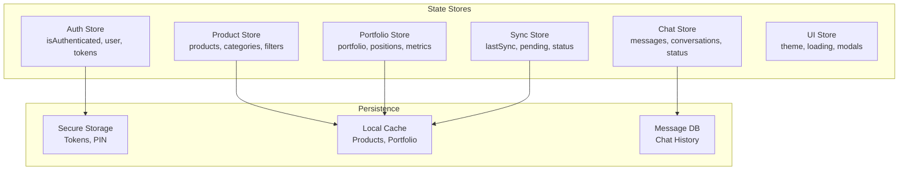

### 5.3 Store Definitions

```typescript
// Auth Store
interface AuthState {
  isAuthenticated: boolean;
  user: User | null;
  tokens: AuthTokens | null;
  loading: boolean;
  error: string | null;
  
  // Actions
  login: (credentials: Credentials) => Promise<void>;
  logout: () => Promise<void>;
  refreshTokens: () => Promise<void>;
  setUser: (user: User) => void;
  clearError: () => void;
}

// Product Store
interface ProductState {
  products: Product[];
  categories: Category[];
  selectedProduct: Product | null;
  filters: ProductFilters;
  loading: boolean;
  error: string | null;
  
  // Actions
  fetchProducts: () => Promise<void>;
  fetchProductDetail: (id: string) => Promise<void>;
  setFilters: (filters: ProductFilters) => void;
  clearFilters: () => void;
}

// Portfolio Store
interface PortfolioState {
  portfolio: Portfolio | null;
  positions: Position[];
  metrics: PortfolioMetrics | null;
  loading: boolean;
  error: string | null;
  lastUpdated: Date | null;
  
  // Actions
  fetchPortfolio: () => Promise<void>;
  fetchPositions: () => Promise<void>;
  calculateMetrics: () => void;
}

// Chat Store
interface ChatState {
  conversations: Conversation[];
  activeConversation: Conversation | null;
  messages: Message[];
  managerStatus: ManagerStatus;
  unreadCount: number;
  loading: boolean;
  sending: boolean;
  error: string | null;
  
  // Actions
  fetchMessages: (conversationId: string) => Promise<void>;
  sendMessage: (text: string) => Promise<void>;
  markAsRead: (messageIds: string[]) => void;
  addMessage: (message: Message) => void;
  updateManagerStatus: (status: ManagerStatus) => void;
}

// Sync Store
interface SyncState {
  lastSync: Date | null;
  syncStatus: 'idle' | 'syncing' | 'error' | 'offline';
  pendingOperations: PendingOperation[];
  
  // Actions
  sync: () => Promise<void>;
  addToQueue: (operation: PendingOperation) => void;
  processQueue: () => Promise<void>;
  setSyncStatus: (status: SyncStatus) => void;
}
```

### 5.4 State Flow Diagram

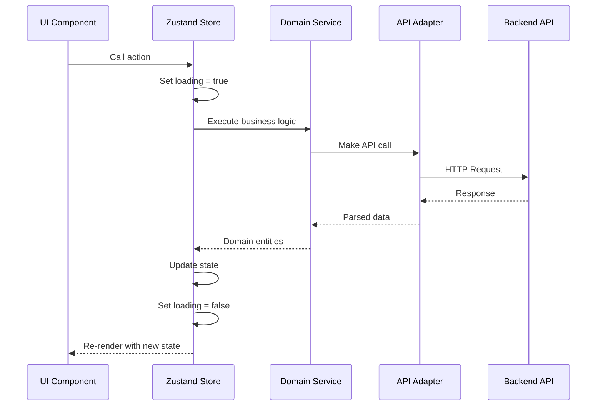

---

## 6. Data Flow Design

### 6.1 Unidirectional Data Flow

The application follows a strict unidirectional data flow pattern:

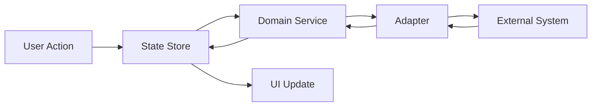

### 6.2 Authentication Flow

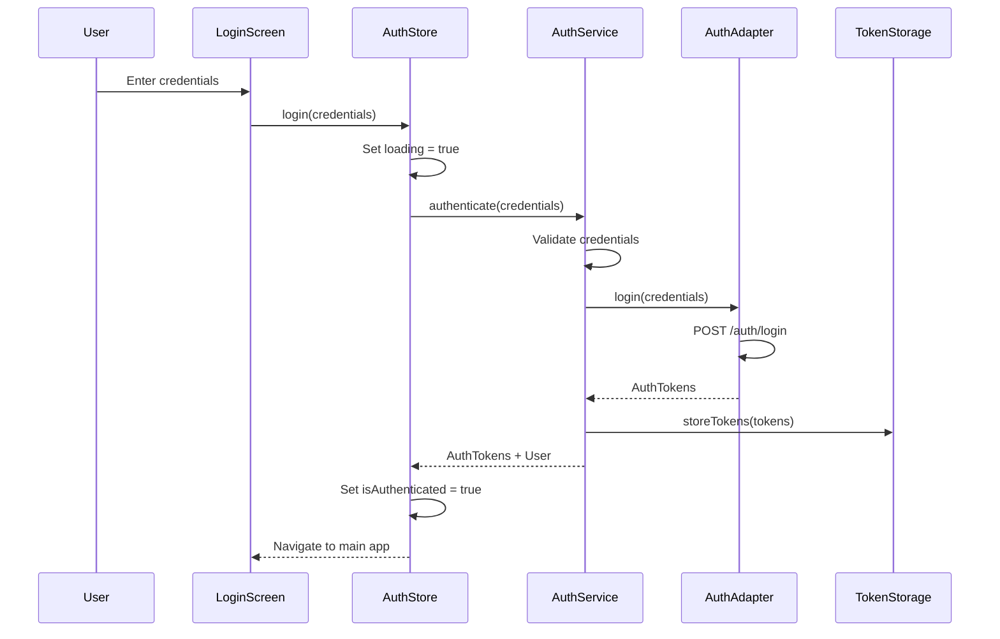

### 6.3 Product Browsing Flow

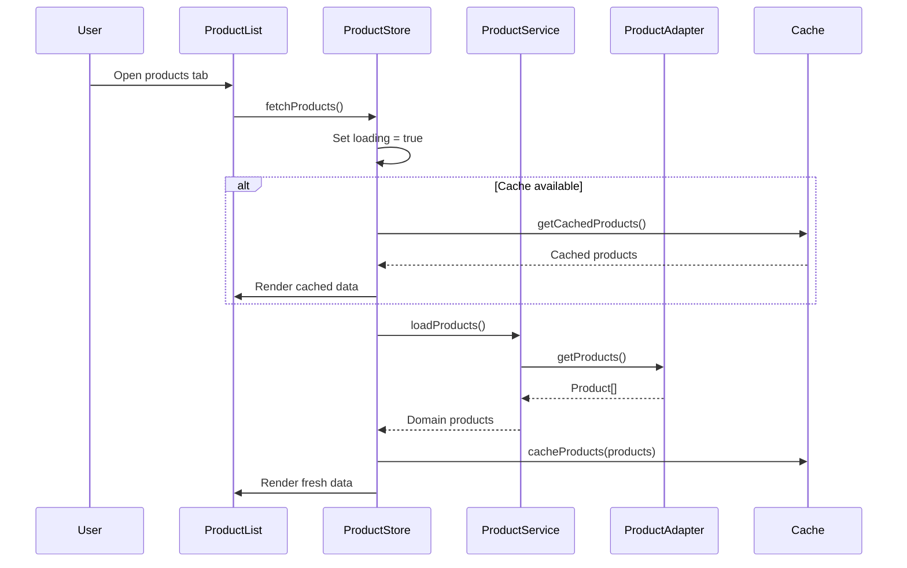

### 6.4 Portfolio Data Flow

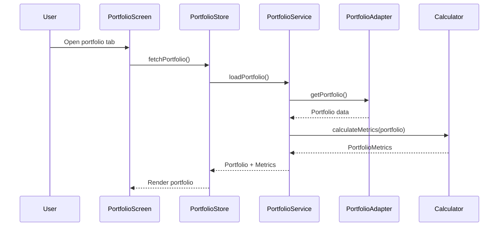

### 6.5 Chat Message Flow (Real-time)

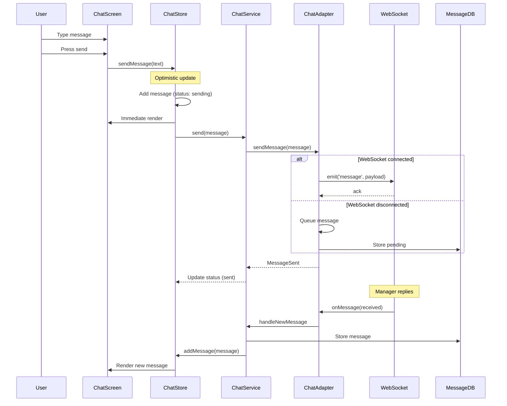

### 6.6 Offline Sync Flow

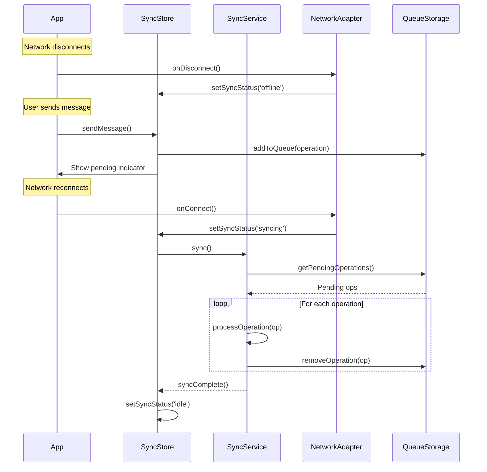

---

## 7. Component Boundaries

### 7.1 Module Boundaries

Each module has clear boundaries and communication interfaces:

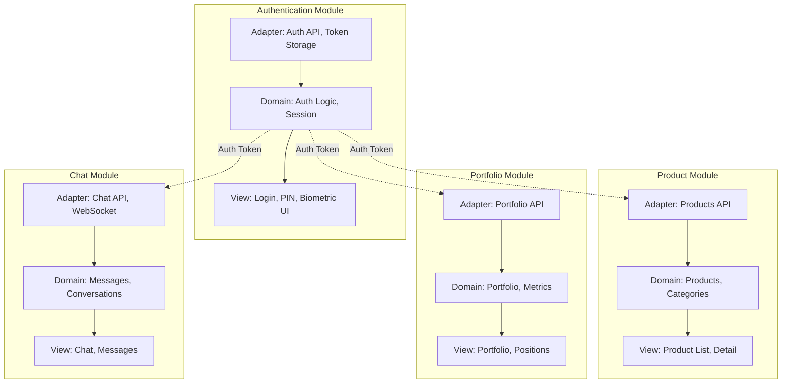

### 7.2 Dependency Rules

| From | To | Allowed? | Reason |
|------|-----|----------|--------|
| View | Domain | ✅ Yes | View depends on domain for logic |
| View | Adapters | ❌ No | View should not know about adapters |
| Domain | View | ❌ No | Domain has no UI knowledge |
| Domain | Adapters | ❌ No | Domain defines interfaces, adapters implement |
| Adapters | Domain | ✅ Yes | Adapters implement domain interfaces |
| Adapters | View | ❌ No | Adapters have no UI knowledge |

### 7.3 Interface Contracts

```typescript
// Domain defines interfaces (ports)
interface IAuthAdapter {
  login(credentials: Credentials): Promise<AuthTokens>;
  logout(): Promise<void>;
  refreshToken(refreshToken: string): Promise<AuthTokens>;
}

interface IProductAdapter {
  getProducts(): Promise<Product[]>;
  getProductDetail(id: string): Promise<Product>;
  getCategories(): Promise<Category[]>;
}

interface IPortfolioAdapter {
  getPortfolio(): Promise<Portfolio>;
  getPositions(): Promise<Position[]>;
  getPositionDetail(id: string): Promise<Position>;
}

interface IChatAdapter {
  getMessages(conversationId: string, cursor?: string): Promise<Message[]>;
  sendMessage(message: NewMessage): Promise<Message>;
  markAsRead(messageIds: string[]): Promise<void>;
}

interface IStorageAdapter {
  get<T>(key: string): Promise<T | null>;
  set<T>(key: string, value: T): Promise<void>;
  remove(key: string): Promise<void>;
  clear(): Promise<void>;
}

interface IWebSocketAdapter {
  connect(token: string): Promise<void>;
  disconnect(): void;
  send(event: string, data: unknown): void;
  on(event: string, handler: Function): void;
  off(event: string, handler: Function): void;
}
```

---

## 8. Navigation Architecture

### 8.1 Navigation Structure

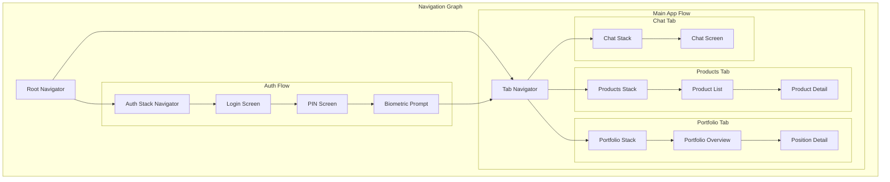

### 8.2 Deep Linking Map

```typescript
const linkingConfig = {
  prefixes: ['investapp://', 'https://app.investcompany.com'],
  config: {
    screens: {
      Auth: {
        screens: {
          Login: 'login',
        },
      },
      Main: {
        screens: {
          ProductsTab: {
            screens: {
              ProductList: 'products',
              ProductDetail: 'products/:id',
            },
          },
          PortfolioTab: {
            screens: {
              PortfolioOverview: 'portfolio',
              PositionDetail: 'portfolio/positions/:id',
            },
          },
          ChatTab: {
            screens: {
              ChatScreen: 'chat',
            },
          },
        },
      },
    },
  },
};
```

---

## 9. Data Models

### 9.1 Core Domain Entities

```typescript
// User Entity
interface User {
  id: string;
  email: string;
  firstName: string;
  lastName: string;
  phone?: string;
  managerId?: string;
  createdAt: Date;
}

// AuthTokens Entity
interface AuthTokens {
  accessToken: string;
  refreshToken: string;
  expiresAt: Date;
  tokenType: 'Bearer';
}

// Product Entity
interface Product {
  id: string;
  name: string;
  description: string;
  categoryId: string;
  type: 'strategy' | 'individual';
  riskLevel: 'low' | 'medium' | 'high';
  minimumInvestment: number;
  currency: string;
  expectedReturn?: number;
  historicalReturn?: number;
  parameters: ProductParameter[];
  conditions: ProductCondition[];
}

// Category Entity
interface Category {
  id: string;
  name: string;
  description?: string;
  productCount: number;
}

// Portfolio Entity
interface Portfolio {
  id: string;
  userId: string;
  totalValue: number;
  currency: string;
  change24h: number;
  changePercent24h: number;
  lastUpdated: Date;
}

// Position Entity
interface Position {
  id: string;
  assetId: string;
  assetName: string;
  assetSymbol: string;
  assetType: 'stock' | 'bond' | 'fund' | 'cash';
  quantity: number;
  averagePrice: number;
  currentPrice: number;
  currentValue: number;
  profitLoss: number;
  profitLossPercent: number;
  weight: number;
}

// Message Entity
interface Message {
  id: string;
  conversationId: string;
  senderId: string;
  senderType: 'client' | 'manager';
  text: string;
  timestamp: Date;
  status: 'sending' | 'sent' | 'delivered' | 'read' | 'failed';
}

// Conversation Entity
interface Conversation {
  id: string;
  participantId: string;
  participantName: string;
  lastMessage?: Message;
  unreadCount: number;
  updatedAt: Date;
}
```

### 9.2 Entity Relationships

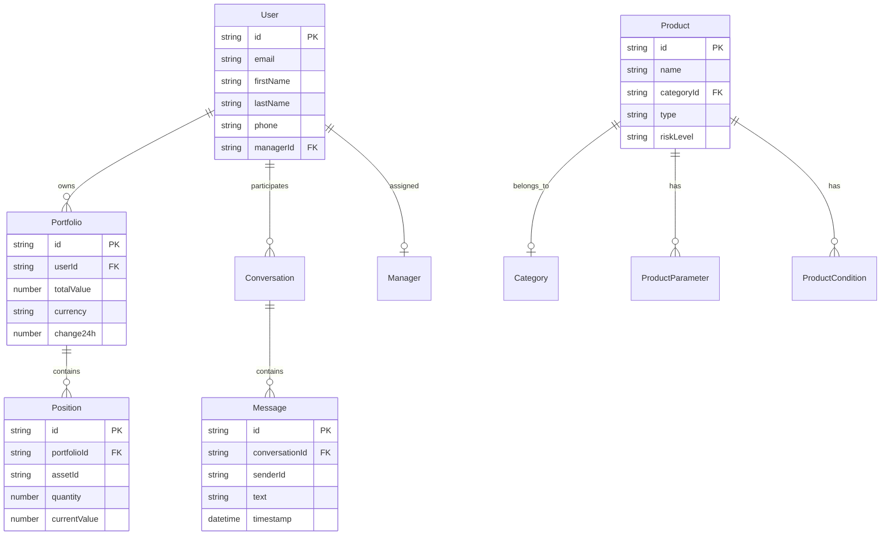

---

## 10. Security Architecture

### 10.1 Authentication Architecture

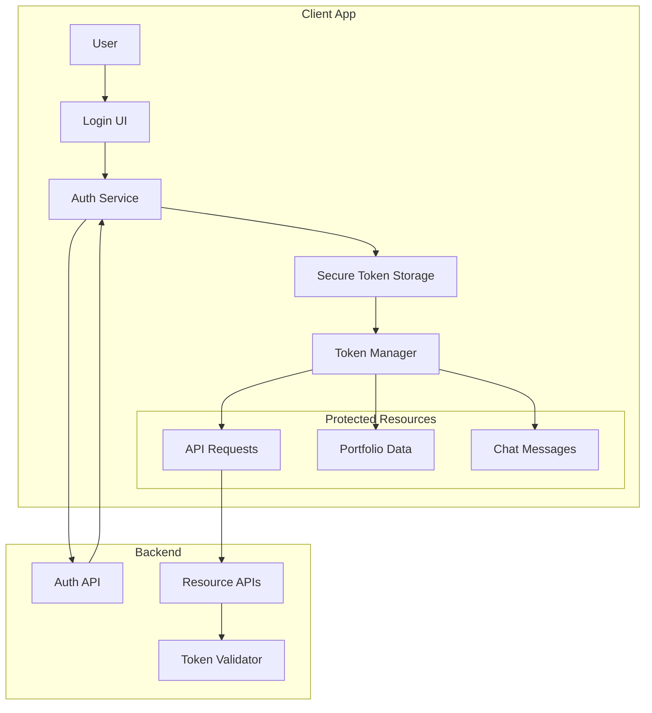

### 10.2 Token Management Flow

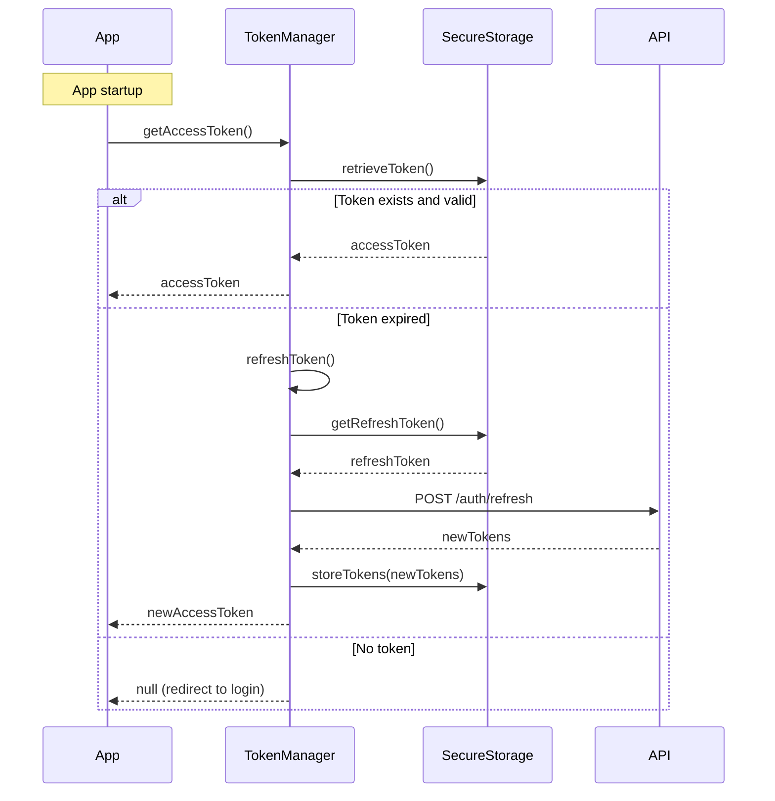

### 10.3 Data Protection Layers

| Layer | Protection | Implementation |
|-------|------------|----------------|
| **Network** | TLS 1.2+ | HTTPS for all requests |
| **Authentication** | JWT + Refresh | Short-lived access tokens |
| **Token Storage** | Hardware-backed | iOS Keychain / Android Keystore |
| **PIN Storage** | Hashed | bcrypt with salt |
| **Local Cache** | Encrypted | SQLite with SQLCipher or Realm encryption |
| **Memory** | Sensitive data cleared | Clear on background/app lifecycle |

---

## 11. Scalability Considerations

### 11.1 Performance Optimization Strategies

| Area | Strategy | Implementation |
|------|----------|---------------|
| **List Performance** | Virtualization | FlatList with getItemLayout |
| **Image Loading** | Lazy loading + caching | react-native-fast-image |
| **State Updates** | Selective subscriptions | Zustand selectors |
| **Bundle Size** | Code splitting | Dynamic imports for features |
| **Memory** | Object pooling | Reuse message objects in chat |
| **Startup Time** | Lazy initialization | Defer non-critical services |

### 11.2 Caching Strategy

```mermaid
graph LR
    subgraph "Cache Layers"
        Memory[Memory Cache<br/>Hot data]
        Disk[Disk Cache<br/>Persistence]
        Network[Network<br/>Fresh data]
    end
    
    Request[Data Request] --> Memory
    
    alt Memory hit
        Memory --> Response[Return data]
    else Memory miss
        Memory --> Disk
        alt Disk hit
            Disk --> Response
            Disk --> Memory
        else Disk miss
            Disk --> Network
            Network --> Response
            Network --> Disk
            Network --> Memory
        end
    end
```

### 11.3 Message Storage Strategy

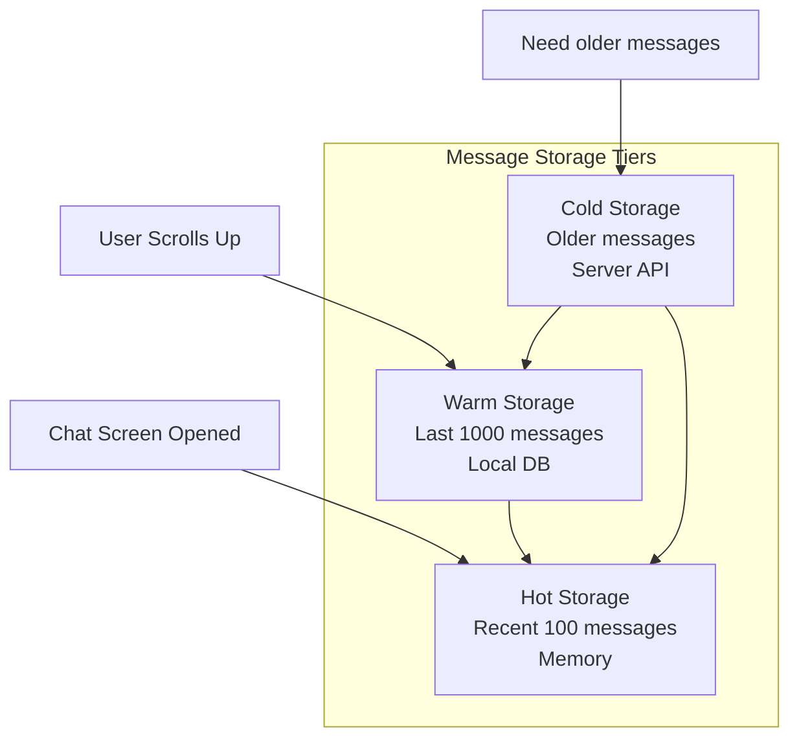

---

## 12. Technology Stack Summary

### 12.1 Core Dependencies

| Category | Package | Version | Purpose |
|----------|---------|---------|---------|
| **Framework** | react-native | 0.73+ | Cross-platform mobile |
| **Language** | typescript | 5.0+ | Type safety |
| **State** | zustand | 4.4+ | Global state management |
| **Navigation** | @react-navigation/native | 6.x | Screen navigation |
| **Styling** | nativewind | 4.x | Tailwind CSS for RN |
| **HTTP** | axios | 1.6+ | API requests |
| **WebSocket** | socket.io-client | 4.x | Real-time chat |
| **Secure Storage** | react-native-keychain | 8.x | Token storage |
| **Local DB** | @nozbe/watermelondb | 0.27+ | Offline storage |
| **Biometrics** | react-native-biometrics | 3.x | Face ID/Touch ID |
| **Push** | @react-native-firebase/messaging | 18.x | Push notifications |
| **Network** | @react-native-community/netinfo | 11.x | Connection monitoring |
| **Forms** | react-hook-form | 7.x | Form handling |
| **Validation** | zod | 3.x | Schema validation |

### 12.2 Development Dependencies

| Category | Package | Purpose |
|----------|---------|---------|
| **Testing** | jest + @testing-library/react-native | Unit and component tests |
| **E2E** | detox | End-to-end testing |
| **Linting** | eslint + prettier | Code quality |
| **Types** | @types/* | TypeScript definitions |

---

## 13. Glossary

| Term | Definition |
|------|------------|
| **View Layer** | UI components, screens, and navigation |
| **Domain Layer** | Business logic, entities, and use cases |
| **Adapter Layer** | External integrations, API clients, storage |
| **Store** | Zustand state container for a specific domain |
| **Adapter** | Implementation of a domain interface for external systems |
| **Use Case** | Orchestrator for complex business workflows |
| **Entity** | Core business object with identity |
| **Service** | Domain logic coordinator |
| **Deep Link** | URL scheme to navigate directly to app content |
| **Token** | JWT authentication credential |

---

## 14. Appendix

### A. File Structure (Complete)

```
investment-app/
├── src/
│   ├── view/
│   │   ├── screens/
│   │   │   ├── auth/
│   │   │   ├── products/
│   │   │   ├── portfolio/
│   │   │   ├── chat/
│   │   │   └── profile/
│   │   ├── components/
│   │   │   ├── common/
│   │   │   ├── products/
│   │   │   ├── portfolio/
│   │   │   └── chat/
│   │   ├── navigation/
│   │   └── hooks/
│   ├── domain/
│   │   ├── entities/
│   │   ├── services/
│   │   ├── usecases/
│   │   ├── calculators/
│   │   └── utils/
│   ├── adapters/
│   │   ├── api/
│   │   ├── websocket/
│   │   ├── storage/
│   │   └── platform/
│   ├── stores/
│   │   ├── authStore.ts
│   │   ├── productStore.ts
│   │   ├── portfolioStore.ts
│   │   ├── chatStore.ts
│   │   └── syncStore.ts
│   ├── shared/
│   │   ├── types/
│   │   ├── constants/
│   │   └── utils/
│   └── App.tsx
├── android/
├── ios/
├── package.json
├── tsconfig.json
└── README.md
```

### B. Key Architectural Decisions

| Decision | Choice | Rationale |
|----------|--------|-----------|
| Architecture Pattern | Clean Architecture | Separation of concerns, testability |
| State Management | Zustand | Minimal boilerplate, excellent TS support |
| Local Database | WatermelonDB | Performance, lazy loading, observability |
| WebSocket | Socket.io | Reliability, reconnection handling |
| Styling | NativeWind | Developer experience, consistency |

---

*Document generated by System Architect Agent*  
*Version 1.0 | Date: 2026-04-17*